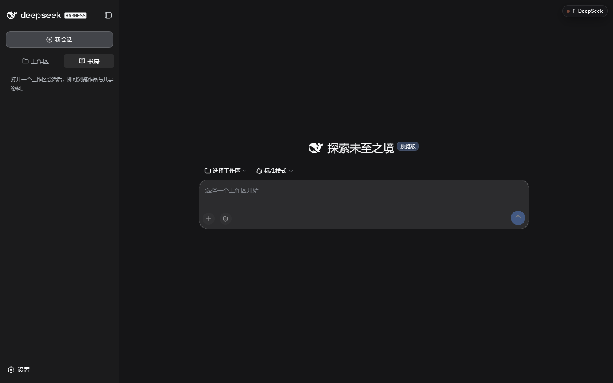
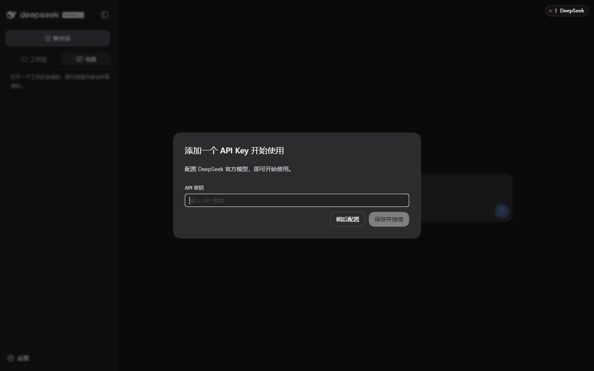
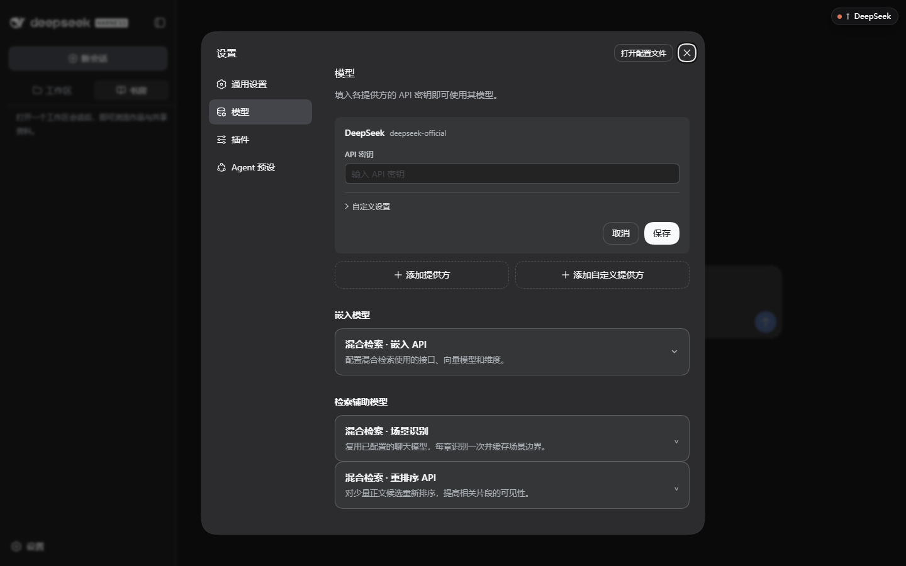
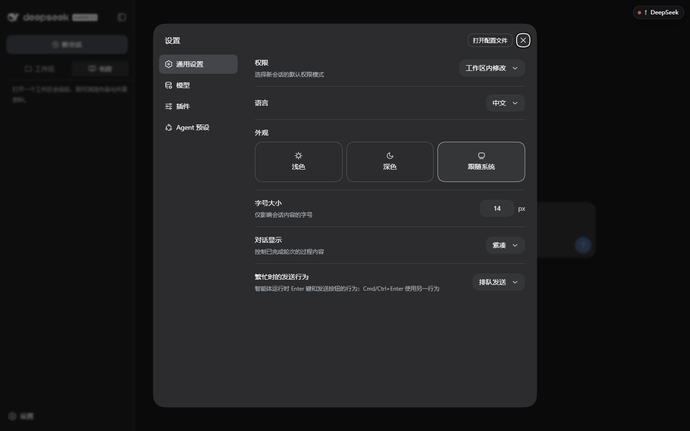
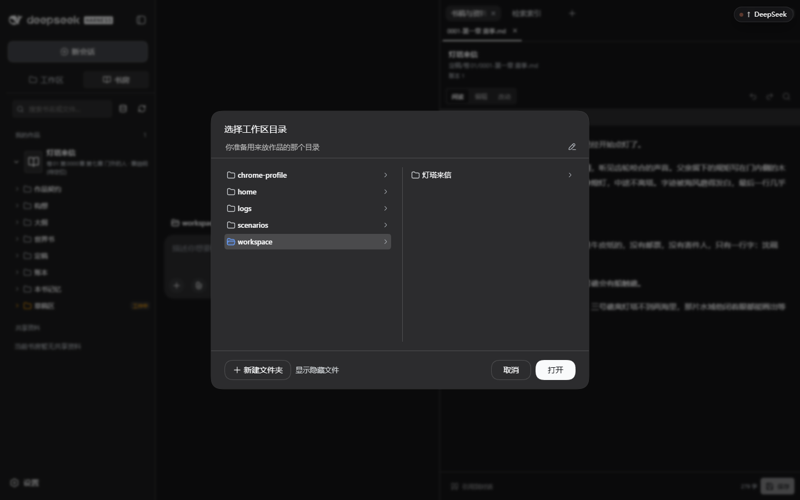
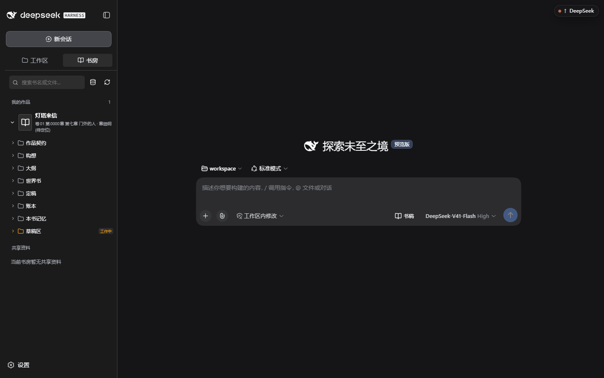
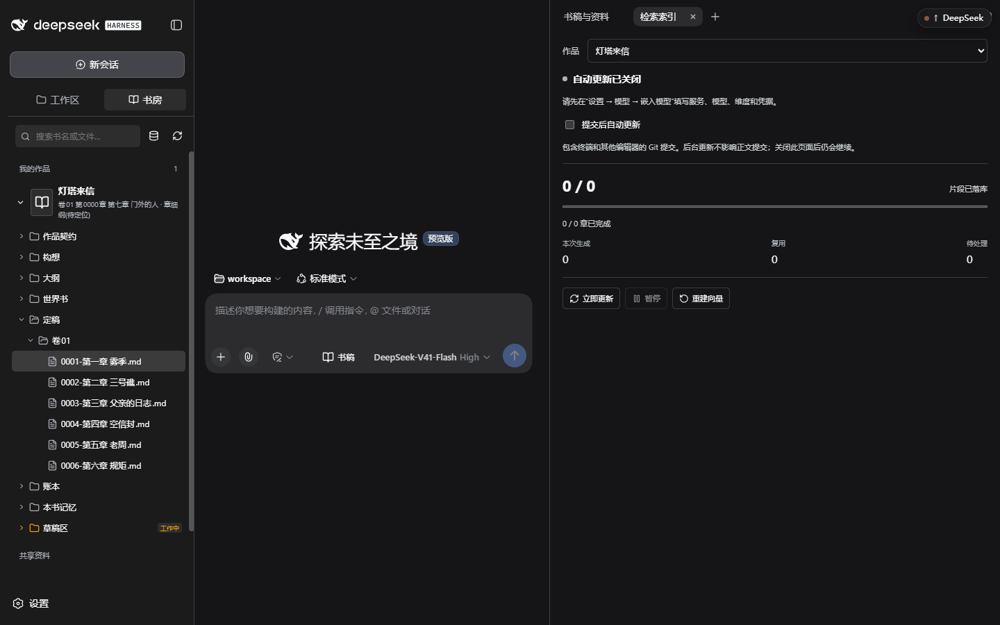
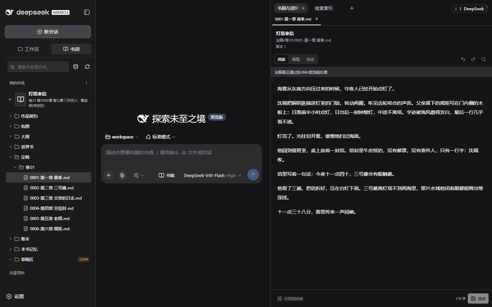
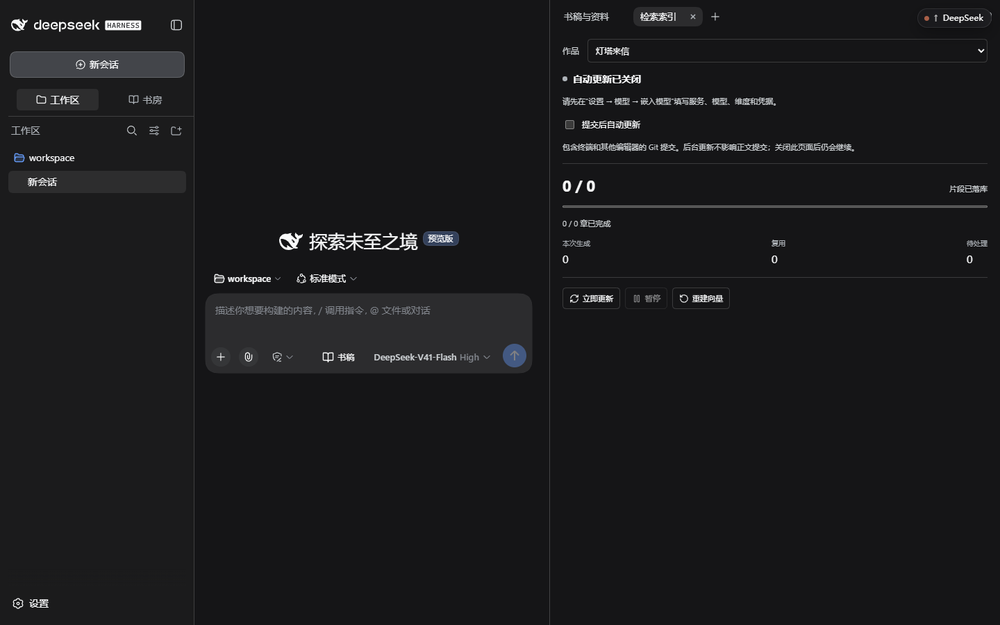

# 新手图文教程：从安装到第一章

本教程按装运行环境 → 启动工作台 → 配置模型 → 打开工作区 → 建书 → 写第一章 → 定稿与恢复组织。安装基线为 **DSH 0.1.5-rc.2、Scriptor 0.1.0-preview.6、嵌入提供方 0.0.8**，细节分支见各专题文档。

截图取自 preview.5 的独立演示环境（合成作品《灯塔来信》、占位凭据、未调用收费模型），用于说明界面位置。

**旧版升级**：preview.6 包含快速设计、审核回写与保存后重复调用的修复。升级不会自动补全旧书的设计正文；按 [首书教程](first-book.md) 核对内容，遇到模块缺失按 [排错](troubleshooting.md) 处理。版本变化见 [更新记录](../../CHANGELOG.md)。

## 0. 先分清五个概念

| 名称 | 是什么 | 你要管的事 |
| --- | --- | --- |
| **DSH**（DeepSeek Harness） | 运行工作台的宿主程序。会话、模型连接、凭据、文件与命令权限都由它负责 | 安装并保持版本一致 |
| **Scriptor 插件** | 小说写作工作台本体，以插件形式装进 DSH 的某个 profile | 安装、升级 |
| **profile** | 一份插件组装，例如 `scriptor`。不同 profile 的插件与设置互不影响 | 起名字，别和别的 DSH 用途重名 |
| **模型 API** | 你自备的模型服务。聊天是主用途，嵌入／场景识别／重排是三类可选用途 | 填地址、模型标识与密钥，自付费用 |
| **作品目录（工作区）** | 本会话处理作品的目录；实际读写权限由宿主访问模式控制 | 准备一个空目录并备份 |

一本书 = 工作区下的一个子目录，判断标准是它含 `作品契约/契约.md`。同一个工作区可以放多本书；一个 profile 可以先后服务多个工作区。

## 1. 安装运行环境与插件

先装 **Node.js 24.15.0**（也支持 22.19.0 起的 Node 22）、**Git for Windows**、**PowerShell 7**，然后在 PowerShell 里执行：

```powershell
npm install --global pnpm@11.27.1 @deepseek-ai/dsh@0.1.5-rc.2
dsh --version          # 期望输出 0.1.5-rc.2
```

创建 profile 并安装插件（二选一，不要都装）：

```powershell
# 只要主插件
dsh --profile scriptor --from-default-profile web --dump-config
dsh plugin --profile scriptor add @linfengqaqtat/dsh-scriptor@0.1.0-preview.6

# 主插件 + 嵌入提供方（想用增强索引时选这个）
dsh --profile scriptor --from-default-profile web --dump-config
dsh plugin --profile scriptor add @linfengqaqtat/dsh-scriptor-full@0.1.0-preview.6
```

**成功标志**：`dsh --profile scriptor --dump-config` 的输出里能看到 `id: webnovel`；装完整版时还应看到 `id: webnovel-embeddings`。没有出现就停下排查，不要继续往下走。

首次创建必须用 `web` 模板；不要向不存在的 profile 直接加插件，那样只会得到没有网页界面的基础配置。离线包、SHA256 核对、换 profile 名等分支见 [安装教程](install.md)。

## 2. 第一次启动

先准备一个专门存作品的**空目录**（可以带空格，路径中不要放密钥或作品备份），在该目录打开 PowerShell 7，再启动：

```powershell
dsh --profile scriptor --host 127.0.0.1 --port 6104 --no-open
```

终端会打印一行 `dsh web: http://127.0.0.1:6104/?token=...`。用**这条带 token 的完整链接**打开浏览器；token 相当于临时登录口令，不要截图外发。端口被占用时换一个空闲端口即可。



首屏三块：左侧是导航（新会话／工作区／书房／设置），中间是对话区与输入框，右上角随会话打开的面板（书稿与资料、检索索引）。此时还没有工作区，所以输入框提示「选择一个工作区开始」。

## 3. 配置主模型

第一次打开会弹出密钥引导：



- **只在官方 DeepSeek 服务上**用这个弹窗最省事：粘贴密钥 → 保存并继续。密钥交给宿主凭据服务保管，不会写进作品文件。
- 用别的服务（自建、代理、其他厂商）时点「稍后配置」，到 **设置 → 模型** 里添加。内置厂商选 **添加提供方**；自建/代理选 **添加自定义提供方**，逐字段填法与协议示例见 [主模型配置](configuration.md#主模型逐步填写)。



这一页管四类用途，先只配第一类也能写作：

| 用途 | 位置 | 作用 | 是否必须先配 |
| --- | --- | --- | --- |
| **聊天（主模型）** | 页面上方提供方卡片 | 构想、细纲、正文、审读都由它生成 | 是 |
| **嵌入 API** | 嵌入模型 → 混合检索 · 嵌入 API | 语义检索：把定稿切片转向量 | 否 |
| **场景识别** | 检索辅助模型 → 混合检索 · 场景识别 | 复用聊天模型，给章节打场景边界 | 否 |
| **重排序 API** | 检索辅助模型 → 混合检索 · 重排序 API | 查询时对候选片段重排 | 否 |

要点：

1. 用服务方给出的**精确模型标识**，不要从示例名称推测。
2. 填写 API 协议、API 地址、密钥和至少一个模型 ID，点 **创建提供方**（修改已有卡片则点 **保存**）。关闭设置并选好工作区，在输入框底部选择该服务与模型，发一条短消息试通。收到正常回答再开始建书。
3. 后三类是 [增强索引](enhanced-index.md) 的内容，可以先全部留空；基础写作不依赖它们。

同一页上方还有别的配置分区，常用的是 **通用设置** 里的权限模式、语言、外观与字号：



「权限」决定新会话默认能在工作区里改多少东西（本教程用默认的「工作区内修改」）。「打开配置文件」会打开这个 profile 的配置文件，手工改前请先备份。插件与预设分区见 [界面与按钮参考](ui-reference.md)。

## 4. 打开工作区

点输入框上方的**选择工作区** → 「添加工作区…」，在打开的目录选择窗口里定位到第 2 步准备的目录。Windows 通常使用系统原生对话框；下图是演示环境的应用内备用选择器，样式可能与你不同，目标都是选中作品目录后点「打开」：



- 若出现图中的应用内选择器，面包屑右侧的铅笔按钮可以直接键入路径；左侧是当前位置的父级列表，右侧是当前目录内容。
- 若出现 Windows 系统对话框，使用地址栏定位目录。
- 也可以用选择窗口里的「新建文件夹」当场建一个作品目录。

打开后，工作台会把该目录作为本会话的工作范围；侧边栏底部会显示当前目录，随时可以用同一入口切换。

## 5. 建第一本书

工作台没有「新建作品」按钮：**建书在对话里完成**。把 [合成练习素材](../../examples/first-book.md) 粘进输入框，再发送：

> 按这些素材准备《灯塔来信》。先整理构想七要素给我确认；这是合成练习，一卷三章，先完成第一章。

接下来会出现确认点，请把它们当作真正需要你判断的地方，而不是过场动画：

1. **构想确认** —— 七要素齐了才允许建书。缺项会被拒绝，属于正常保护。
2. **作品定调** —— 作品契约、故事骨架、分卷布局、卷规划的主要选择。
3. **章细纲** —— 场景推进、读者承诺、章尾悬念；确认后才进正文。

成功标志：书出现在左侧「书房」里，且能看到书名与文件树；只出现一段聊天文字不代表已经落盘。



更细的提示词与判断标准见 [第一本书与第一章](first-book.md)。

接着发送：

> 使用逐部设计流程。每一部分都写出真实内容，先给我看，再由我确认；不要用只有「已确认」标签的占位设计。近期窗口条目名与第一章章名保持一致。

确认细纲后发送「按已确认细纲写第一章，完成审读和必要修改，定稿前交给我确认」。阅读待审稿、检查修改是否符合意图，再继续第 7 节。**本教程截图里的六章定稿是预置演示数据，不是你刚建书就会自动得到的结果。**

## 6. 读稿、改稿与可视化

在书房里逐级展开「定稿 → 卷01 → 章节」，点文件名即可在右侧打开文档：





- 顶部显示**书名 / 相对路径 / 版本号**；`阅读｜编辑｜改动` 三个模式切换查看、直接改、看差异。
- 定稿正文的提示「定稿更正通过吃书补偿流程处理」：已定稿内容要改设定或事实，走补偿流程留痕，而不是随手覆盖。
- 底部「引用到对话」把当前段落带进对话上下文；「保存」写入文件，未保存时标签页会显示 ●。
- 「工作区」标签页同时列出工作区与会话，适合一边看稿一边对话：



「可视化」随会话视图提供（作品视图：时间线关系图谱／章节进度），用来核对章节推进与时间线落点，展开与刷新按钮见 [界面与按钮参考](ui-reference.md)。

## 7. 定稿、恢复与导出

- **定稿**：查看正文、审读结论与拟沉淀事实后再批准。成功应有定稿文件和对应版本提交；有获批沉淀时，还应有账本／本书记忆相关变化。仅看见批准按钮被点击不算成功，要核对工具结果。
- **恢复**：关掉会话重新打开后发送「继续《灯塔来信》，先核对实际书仓进度，告诉我第一章是否已经定稿」。状态应从文件重新校准，而不是复述旧结论。
- **导出**：请求「准备卷一已定稿内容的导出合集和来源清单，先告诉我目标目录和冲突情况」，确认目标后再保存。合集只含指定范围内的定稿。

## 8. 别把这五件事混为一谈

| 动作 | 实际含义 |
| --- | --- |
| 界面上看到了正文 | 只是打开了一个文件视图 |
| 草稿区里生成了文字 | 还没审读、没定稿 |
| 文件已保存 | 磁盘上有内容，尚未成为可信的定稿事实 |
| 作者已确认 | 表达了认可；仍须对应确认工具成功执行，不能仅凭一句「确认」判定已提交 |
| Git 已提交 | 留下了版本历史；设计提交、作者修改提交都不等于章节定稿 |

判断进度一律回文件：`定稿/` 目录、账本与版本历史。只有模型承诺、没有文件变化，都算没完成。

## 9. 卡住了先看这里

| 现象 | 常见原因 | 处理 |
| --- | --- | --- |
| `dsh --profile scriptor --dump-config` 里没有 `id: webnovel` | 插件没装进这个 profile，或装到了别的 profile | 重新执行 `dsh plugin --profile scriptor add ...` |
| 页面打不开或提示重新打开链接 | 用了不带 token 的地址，或换了终端重启 | 重新复制当次启动打印的完整链接 |
| 发消息没有正常回答 | 主模型未配置、模型标识不对、额度或速率受限 | 到设置 → 模型核对并试通一条短消息 |
| 书房提示「请在当前主会话中打开书房」 | 当前是未开始的新会话 | 先选择工作区打开，或从会话列表进入已有会话 |
| 建书被拒绝 | 构想未确认或要素不完整 | 补齐七要素并明确确认 |

更多现象与处理见 [故障排查](troubleshooting.md)；备份、升级与卸载见 [备份与升级](upgrade-backup.md)；检索相关的数据流与费用见 [隐私与费用](privacy.md)。
