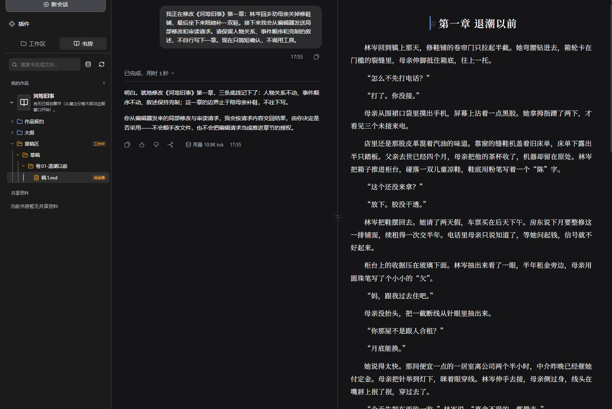
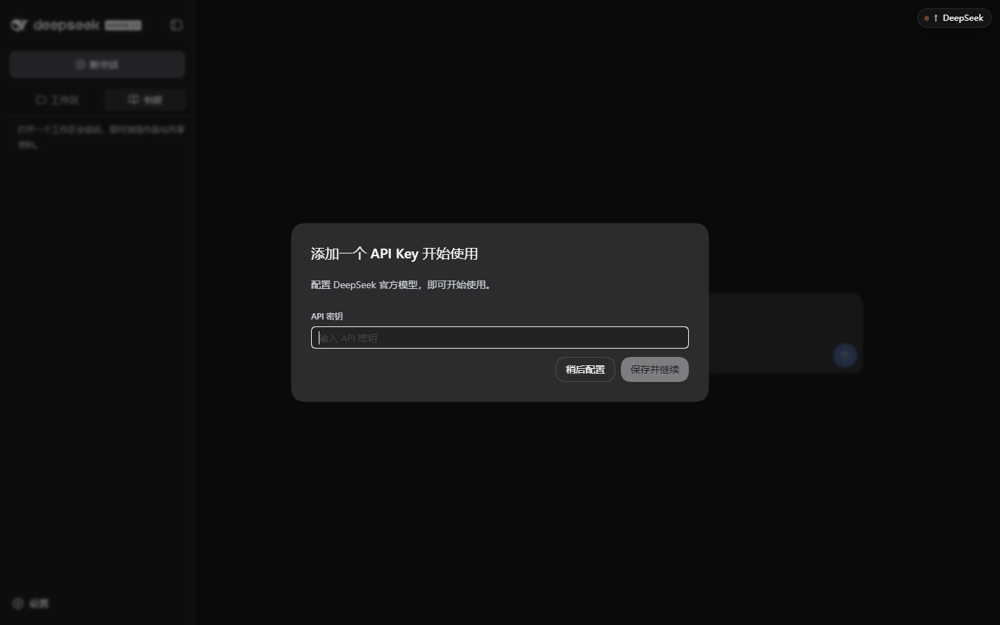
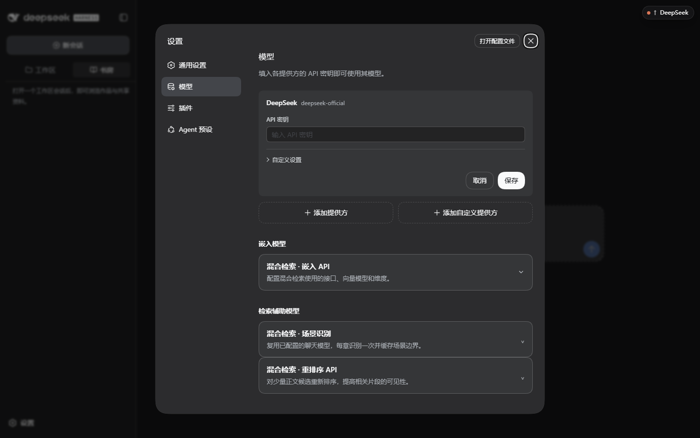
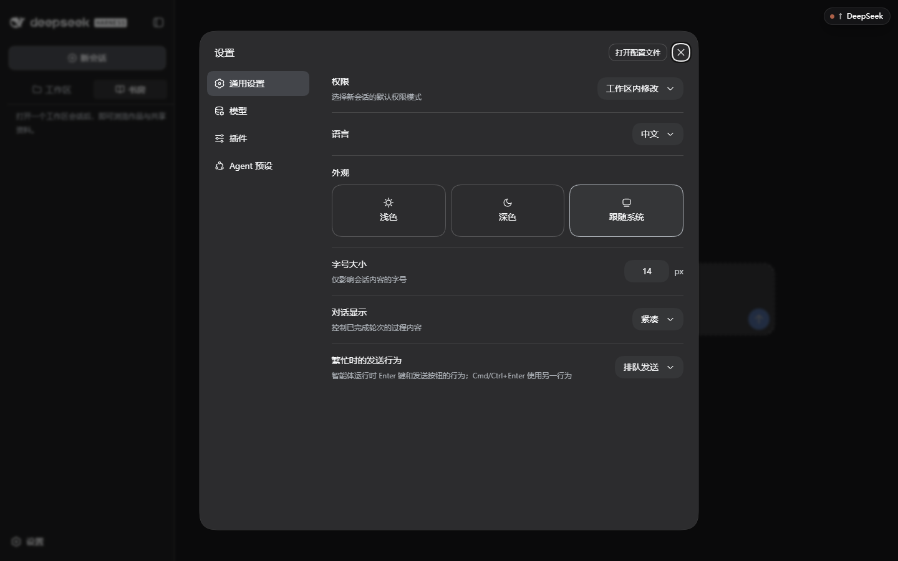
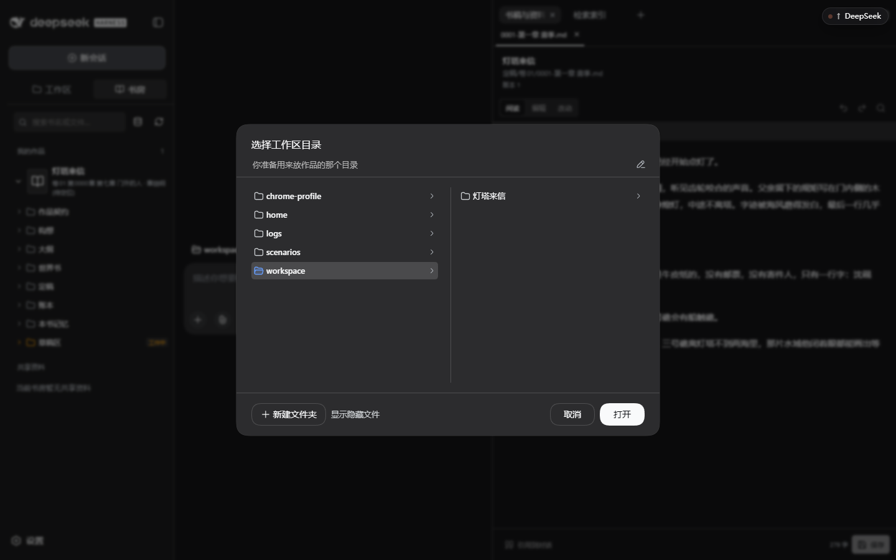
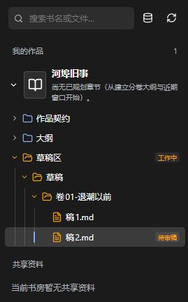
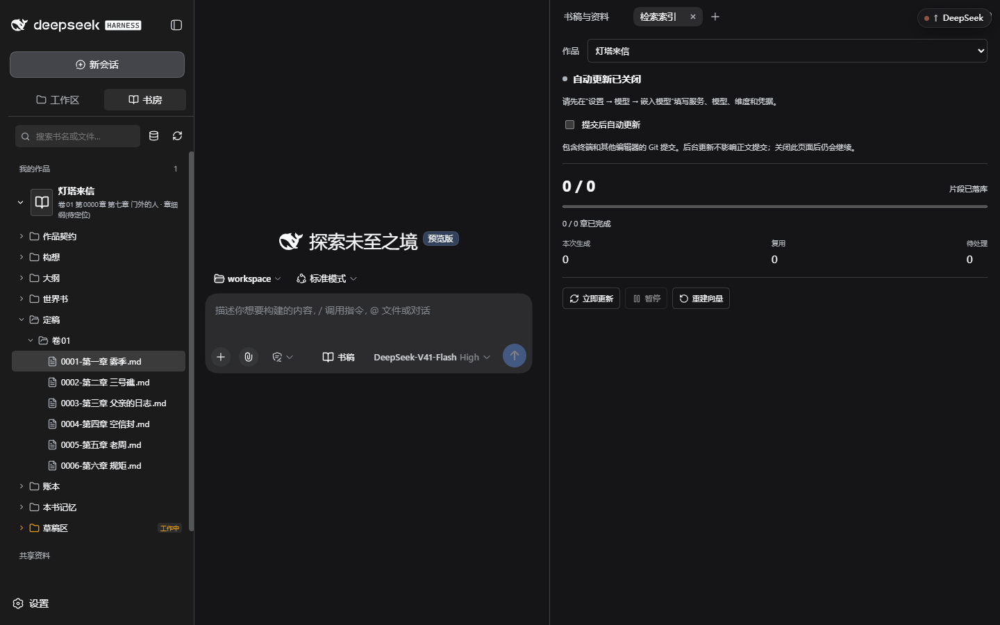
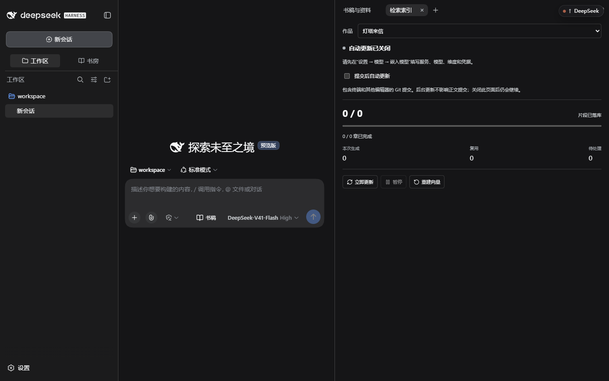

# 新手教程：从安装到第一章

> [!IMPORTANT]
> Scriptor 8.2.0 正式版配套 **DSH 0.2.0-rc.2**。三个功能插件与完整版都是 8.2.0。
> 从旧版升级前，先备份。安装和升级的做法见后面的专题文档。

本教程的顺序是：安装运行环境，启动工作台，配置模型，打开工作区，建书，写第一章，然后定稿与恢复。8.2.0 要求 **DSH 0.2.0-rc.2**。可以安装精确的 npm 版本，也可以安装对应 Release 的原件。细节见各专题文档。

> [!NOTE]
> 工作台、书房和编辑器截图已于 2026-10-06 更新到 8.2.0。
> 图中《河埠旧事》是原创小说示例，编辑建议与批注来自 DeepSeek 官方 API 的实际调用。其余截图保留历史演示数据，用于定位区域。

> [!CAUTION]
> 升级到 8.2.0 之前先备份。
> 还要 [补充确认作品契约的章节篇幅](upgrade-backup.md#旧项目需要更新作品契约)。升级不会自动填入范围，也不会改写旧章。未配置时仍可使用，但没有篇幅达标判定。版本变化见 [更新记录](../../CHANGELOG.md)。

## 0. 先分清五个概念

| 名称 | 是什么 | 你要管的事 |
| --- | --- | --- |
| **DSH**（DeepSeek Harness） | DSH 运行工作台。会话、模型连接、凭据、文件与命令权限都由它负责 | 安装并保持版本一致 |
| **Scriptor 插件** | 小说写作工作台本体，以插件形式装进 DSH 的某个 profile | 安装、升级 |
| **profile** | 一份插件组装，例如 `scriptor`。不同 profile 的插件与设置互不影响 | 起名字，别和别的 DSH 用途重名 |
| **模型 API** | 你自备的模型服务。聊天是主用途，嵌入／场景识别／重排是三类可选用途 | 填地址、模型标识与密钥，自付费用 |
| **工作区** | 本会话处理作品的目录。实际读写权限由 DSH 的访问模式控制 | 准备一个空目录并备份 |

一本书是工作区下的一个子目录。判断标准是它含有 `作品契约/契约.md`。同一个工作区可以放多本书。一个 profile 可以先后服务多个工作区。

## 1. 通过插件管理安装

1. 从 [DSH 官网](https://www.deepseek.com/harness/) 安装配套的 DSH 0.2.0-rc.2 客户端。
   成功时，桌面端可以打开。
2. 打开侧栏 **插件 → 添加插件**。
3. 输入 `@linfengqaqtat/dsh-scriptor@8.2.0`。
4. 核对预览，然后安装。
5. 按页面提示启用、应用变更或重启。
   成功时，已安装列表显示 8.2.0，并且可以打开书房。

可选的检索增强、鲸鱼娘、完整版，以及旧版迁移，见 [安装教程](install.md)。不需要在终端里安装插件。

## 2. 第一次打开工作区

1. 准备一个专门存放作品的目录。
2. 在 DSH 中新建会话，并选择该工作区。
3. 然后配置主模型。
   成功时，这个会话使用你选中的工作区。

不同工作区里的作品不会自动搬到别处。

> [!NOTE]
> 图中已经打开一个写作会话。
> 新建的空白会话还没有书稿。安装和插件管理以 DSH 0.2.0-rc.2 的当前页面为准。

## 3. 配置主模型

第一次打开时，会弹出密钥引导。

1. 如果只用官方 DeepSeek 服务，在这个弹窗里粘贴密钥，然后保存并继续。
   成功时，DSH 把密钥放进凭据服务。作品文件里没有这把密钥。
2. 如果使用自建、代理或其他厂商，点「稍后配置」。
3. 打开 **设置 → 模型** 再添加。内置厂商选 **添加提供方**。自建或代理选 **添加自定义提供方**。逐字段的填法和协议示例见 [主模型配置](configuration.md#主模型逐步填写)。

这一页管理四类用途。先只配置第一类，也可以开始写作。

| 用途 | 位置 | 作用 | 是否必须先配 |
| --- | --- | --- | --- |
| **聊天（主模型）** | 页面上方提供方卡片 | 构想、细纲、正文、审读都由它生成 | 是 |
| **嵌入 API** | 嵌入模型 → 混合检索 · 嵌入 API | 语义检索：把定稿切片转向量 | 否 |
| **场景识别** | 检索辅助模型 → 混合检索 · 场景识别 | 复用聊天模型，给章节打场景边界 | 否 |
| **重排序 API** | 检索辅助模型 → 混合检索 · 重排序 API | 查询时对候选片段重排 | 否 |

1. 使用服务方给出的**精确模型标识**。不要根据示例名称来猜测。
2. 填写 API 协议、API 地址、密钥，以及至少一个模型 ID。
3. 点 **创建提供方**。如果是在修改已有卡片，则点 **保存**。
4. 关闭设置，并选好工作区。
5. 在输入框底部选择该服务与模型，发送一条短消息。
   成功时，你收到正常回答。然后再开始建书。
6. 后三类属于 [增强索引](enhanced-index.md)。可以先全部留空。基础写作不依赖它们。

同一页上方还有其他配置分区。常用的是 **通用设置** 里的权限模式、语言、外观与字号。

「权限」决定新会话默认能在工作区里改多少东西。本教程使用默认的「工作区内修改」。「打开配置文件」会打开这个 profile 的配置文件。手工修改之前，请先备份。插件与预设分区见 [界面与按钮参考](ui-reference.md)。

## 4. 打开工作区

1. 点输入框上方的**选择工作区**，然后点「添加工作区…」。
2. 在目录窗口中找到第 2 步准备的目录。
   Windows 通常使用系统原生对话框。下图是演示环境里的应用内备用选择器，样式可能不同。成功时，你选中该目录并点「打开」。

- 如果出现图中的应用内选择器，面包屑右侧的铅笔按钮可以直接键入路径。左侧是当前位置的父级列表。右侧是当前目录的内容。
- 如果出现 Windows 系统对话框，用地址栏定位目录。
- 也可以用选择窗口里的「新建文件夹」，当场建一个目录作为工作区。

打开之后，工作台把该目录当作本会话的工作范围。侧边栏底部会显示当前目录。之后可以用同一个入口切换。

## 5. 建第一本书

工作台没有「新建作品」按钮。建书在对话里完成。

1. 把 [合成练习素材](../../examples/first-book.md) 粘进输入框。
2. 发送：

> 按这些素材准备《灯塔来信》。先整理构想七要素给我确认；这是合成练习，一卷三章，先完成第一章。

接下来会出现确认点。把它们当作真正需要你判断的地方，而不是过场动画。

- **构想确认**：七要素齐了，才允许建书。如果缺项，工作台会拒绝。这是正常保护。
- **作品定调**：这里选择作品契约、故事骨架、分卷布局和卷规划。
- **章细纲**：这里确认场景推进、读者承诺和章尾悬念。确认之后才进入正文。

成功时，书出现在左侧「书房」里，并且能看到书名与文件树。只有一段聊天文字，不代表已经落盘。

更细的提示词和判断标准见 [第一本书与第一章](first-book.md)。

3. 接着发送：

> 使用逐部设计流程。每一部分都写出真实内容，先给我看，再由我确认；不要用只有「已确认」标签的占位设计。近期窗口条目名与第一章章名保持一致。

4. 确认细纲后，发送「按已确认细纲写第一章，完成审读和必要修改，定稿前交给我确认」。
5. 阅读待审稿，检查修改是否符合你的意图。
6. 然后继续第 7 节。

> [!NOTE]
> 后面的历史截图中，六章定稿是预置的演示数据。
> 你刚建书时，不会自动得到这些章节。

## 6. 读稿、改稿与可视化

1. 在书房里逐级展开「定稿 → 卷01 → 章节」。
2. 点文件名，在右侧打开文档。
   成功时，右侧出现这一章的正文。

- 核对文档标签和路径之后，再直接编辑。选区浮动栏和右键菜单可以改写、续写和审读。详见 [新编辑器教程](editor.md)。
- 定稿正文会提示「定稿更正通过吃书补偿流程处理」。已定稿的内容要改设定或事实时，走补偿流程并留痕。不要随手覆盖。
- “引用到对话”把原文放进输入框。核对之后，由你自己发送。行内建议采纳后，还要用 `Ctrl+S` 保存。分别看清未保存标记、提交结果和通知结果。
- 「工作区」标签页同时列出工作区与会话，适合一边看稿一边对话。

「可视化」随会话视图提供。作品视图包括时间线关系图谱和章节进度，用来核对章节推进与时间线落点。展开和刷新按钮见 [界面与按钮参考](ui-reference.md)。

## 7. 定稿、恢复与导出

1. **定稿**：先查看正文、审读结论和准备沉淀的事实，再批准。
   成功时，有定稿文件和对应的版本提交。有获批沉淀时，账本或本书记忆也会变化。只看到批准按钮被点过，不算成功。还要核对工具结果。
2. **恢复**：关掉会话，重新打开，然后发送「继续《灯塔来信》，先核对实际书仓进度，告诉我第一章是否已经定稿」。
   成功时，状态从文件重新校准，而不是复述旧结论。
3. **导出**：请求「准备卷一已定稿内容的导出合集和来源清单，先告诉我目标目录和冲突情况」。确认目标之后再保存。
   成功时，合集只包含指定范围内的定稿。

## 8. 别把这五件事混为一谈

| 动作 | 实际含义 |
| --- | --- |
| 界面上看到了正文 | 只是打开了一个文件视图 |
| 草稿区里生成了文字 | 还没审读，也还没定稿 |
| 文件已保存 | 磁盘上有内容，尚未成为可信的定稿事实 |
| 作者已确认 | 你表达了认可。仍须对应的确认工具成功执行。不能只凭一句「确认」就判定已提交 |
| Git 已提交 | 留下了版本历史。设计提交和作者修改提交都不等于章节定稿 |

判断进度时，一律回到文件：`定稿/` 目录、账本和版本历史。只有模型承诺、没有文件变化，都算没有完成。

## 9. 卡住了先看这里

| 现象 | 常见原因 | 处理 |
| --- | --- | --- |
| `dsh --profile scriptor --dump-config` 里没有 `id: webnovel` | 插件没装进这个 profile，或装到了别的 profile | 重新执行 `dsh plugin --profile scriptor add ...` |
| 页面打不开或提示重新打开链接 | 用了不带 token 的地址，或换了终端重启 | 重新复制当次启动打印的完整链接 |
| 发消息没有正常回答 | 主模型未配置、模型标识不对、额度或速率受限 | 到设置 → 模型核对并试通一条短消息 |
| 书房提示「请在当前主会话中打开书房」 | 当前是未开始的新会话 | 先选择工作区打开，或从会话列表进入已有会话 |
| 建书被拒绝 | 构想未确认或要素不完整 | 补齐七要素并明确确认 |

更多现象和处理见 [故障排查](troubleshooting.md)。备份、升级与卸载见 [备份与升级](upgrade-backup.md)。检索相关的数据流与费用见 [隐私与费用](privacy.md)。
