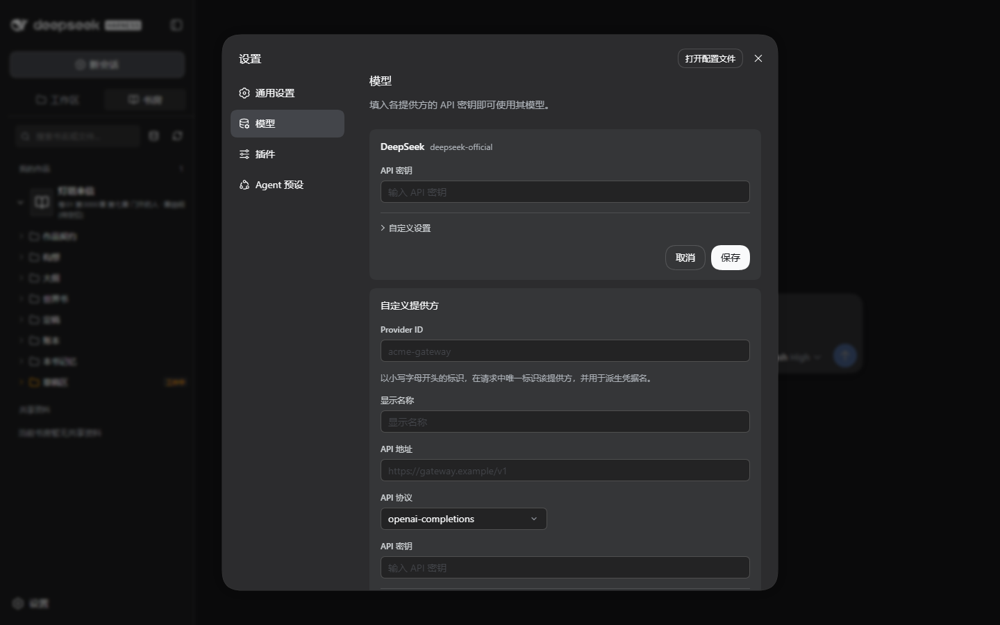

# 主模型与可选检索配置

DSH 负责模型连接与凭据，本插件负责小说工作流。先把一个主聊天模型配置成功，再开始建书；嵌入、场景识别和重排均不是首次安装的前提。

## 最小可用配置

1. 在宿主设置的模型页面添加你实际可用的服务，填写其 API 地址、模型标识和凭据。
2. 把它设为当前任务使用的主模型，发送一条短测试消息。能收到正常回答再运行写作流程。
3. 使用模型服务提供方给出的精确模型标识，不从示例名称猜测服务支持范围。额度、上下文、工具调用能力和速率限制都可能影响写作。

主模型请在设置界面里选择和保存，不要手工改配置文件。

## 主模型逐步填写

打开 **设置 → 模型**。官方 DeepSeek 可直接在其卡片填写 **API 密钥** 并点 **保存**；其他内置厂商点 **添加提供方** 后选择对应厂商。已有卡片的地址与模型目录在 **自定义设置** 中。

自建或代理服务用 **添加自定义提供方**，不要只把第三方密钥填进官方 DeepSeek 卡片：



图中输入框均为空，灰字是占位提示。向下滚动设置面板可继续添加模型，并找到 **创建提供方** 按钮。

| 字段 | 填法 | 示例与注意 |
| --- | --- | --- |
| **Provider ID** | 当前 profile 内唯一的服务标识 | `my-gateway`；小写字母开头，其后用小写字母、数字、短横线 |
| **显示名称** | 模型选择器里容易认出的名字 | `我的模型服务`；不影响接口请求的模型 ID |
| **API 协议** | 与服务文档一致 | Chat Completions 兼容接口选 `openai-completions`；Responses 接口选 `openai-responses`；Anthropic Messages 接口选 `anthropic-messages`。以当前下拉框与服务支持项为准，不根据模型名字猜协议 |
| **API 地址** | 服务文档给出的基础地址 | `https://gateway.example/v1` 仅为占位示例，必须替换；通常不填 `/chat/completions`、`/responses` 等具体请求路径，是否保留 `/v1` 以服务文档为准 |
| **API 密钥** | 这个地址对应的真实密钥 | 直接填密钥值，不填环境变量名；留空保持已有密钥，不代表清除 |
| **模型 ID** | 点 **添加模型**，填服务接受的精确标识 | 将服务给出的模型 ID 原样填入，不能用自己起的显示名称代替 |
| **显示名称（模型）** | 可选的便于辨认的别名 | 留空时使用模型 ID |
| **容量** | 上下文窗口与最大输出 token 数 | 不确定时保留默认；只有服务明确给出限制时才修改，不能靠调大数字增加模型能力 |

若有 **获取可用模型**，先填 API 地址和密钥，再获取并添加所选模型；服务不支持列举时手工添加。获取列表成功只说明目录接口可用，还要试一次聊天。

1. 至少填写一个模型，点 **创建提供方**；修改已有卡片时点 **保存**。确认卡片出现且没有保存错误。
2. 关闭设置，选好工作区，在输入框底部的模型选择器选择刚创建的**服务 + 模型**，推理等级用该模型支持的选项。
3. 发「只回复：连接成功」。收到正常回答后再建书；这次测试会产生少量模型费用。
4. 遇到 401/403 核对密钥、地址和服务权限；404 核对基础地址、协议与模型 ID；429 核对余额/限流。修好后只重试短消息。

保存后可重新打开卡片确认地址和模型还在。密钥通常只显示已配置状态，不会回显原值；模型能回复短消息也不等于已验证长章节、工具调用或创作质量。

API key 由宿主凭据机制保管。不要把 key 写进作品、可提交的 YAML、截图或公开日志。选择主模型并不自动安装额外检索模型。

## 可选 embedding-provider

使用主包安装方式时，可单独添加嵌入提供方；完整版已包含此包：

```powershell
dsh plugin --profile scriptor add webnovel-embedding-provider@0.0.8
```

首次安装默认停用。在“设置 → 模型 → 嵌入模型 → 混合检索 · 嵌入 API”中配置协议、API 根地址、模型、维度及凭据，并显式启用。支持 OpenAI 兼容和 Gemini 原生协议；维度必须与服务真实输出一致。逐项说明、状态与失败处理见 [增强索引操作指南](enhanced-index.md)。

场景识别选择宿主已经配置的聊天模型；重排填写其独立接口与模型。两者默认关闭。重排失败回退原排序，场景识别失败回退段落分块；界面会说明状态，不能把降级当作已获得模型增强效果。

“检测默认维度”会发送一条测试文本，可能收费。启用向量索引后会发送定稿切片；重排会发送查询与候选片段。完整边界见 [隐私与费用](privacy.md)。

常用模型的维度可查 [模型维度表](../../packages/embedding-provider/MODEL_DIMENSIONS.md)。
