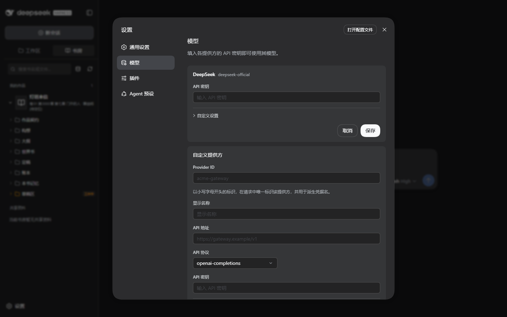

# 主模型与可选检索配置

DSH 负责模型连接和凭据。本插件负责小说工作流。先把一个主聊天模型配置成功，再开始建书。嵌入、场景识别和重排都不是首次安装的前提。

## 最小可用配置

1. 在 DSH 设置的模型页面添加你实际可用的服务。
2. 填写它的 API 地址、模型标识和凭据。
   成功时，设置里出现这张服务卡片。
3. 把它设为当前任务使用的主模型。
4. 发送一条短测试消息。
   成功时，你收到正常回答。然后再运行写作流程。

使用服务方给出的精确模型标识。不要根据示例名称猜测服务支持什么。额度、上下文、工具调用能力和速率限制都可能影响写作。

主模型要在设置界面里选择和保存。不要手工改配置文件。

## 主模型逐步填写

1. 打开 **设置 → 模型**。
2. 如果使用官方 DeepSeek，在它的卡片里填写 **API 密钥**，然后点 **保存**。
3. 如果使用其他内置厂商，点 **添加提供方**，再选择对应厂商。
   已有卡片的地址和模型目录在 **自定义设置** 中。

> [!CAUTION]
> 自建或代理服务要使用 **添加自定义提供方**。
> 不要只把第三方密钥填进官方 DeepSeek 卡片。



图中的输入框都是空的。灰字是占位提示。向下滚动设置面板，可以继续添加模型，并找到 **创建提供方** 按钮。

| 字段 | 填法 | 示例与注意 |
| --- | --- | --- |
| **Provider ID** | 当前 profile 内唯一的服务标识 | `my-gateway`；小写字母开头，其后用小写字母、数字、短横线 |
| **显示名称** | 模型选择器里容易认出的名字 | `我的模型服务`；不影响接口请求的模型 ID |
| **API 协议** | 与服务文档一致 | Chat Completions 兼容接口选 `openai-completions`；Responses 接口选 `openai-responses`；Anthropic Messages 接口选 `anthropic-messages`。以当前下拉框与服务支持项为准，不根据模型名字猜协议 |
| **API 地址** | 服务文档给出的基础地址 | `https://gateway.example/v1` 仅为占位示例，必须替换；通常不填 `/chat/completions`、`/responses` 等具体请求路径，是否保留 `/v1` 以服务文档为准 |
| **API 密钥** | 这个地址对应的真实密钥 | 直接填密钥值，不填环境变量名；留空保持已有密钥，不代表清除 |
| **模型 ID** | 点 **添加模型**，填服务接受的精确标识 | 将服务给出的模型 ID 原样填入，不能用自己起的显示名称代替 |
| **显示名称（模型）** | 可选的便于辨认的别名 | 留空时使用模型 ID |
| **容量** | 上下文窗口与最大输出 token 数 | 不确定时保留默认；只有服务明确给出限制时才修改，不能靠调大数字增加模型能力 |

如果有 **获取可用模型**，先填 API 地址和密钥，再获取并添加所选模型。服务不支持列举时，手工添加。获取列表成功，只说明目录接口可用。还要再试一次聊天。

1. 至少填写一个模型，然后点 **创建提供方**。修改已有卡片时，点 **保存**。
   成功时，卡片出现，并且没有保存错误。
2. 关闭设置，选好工作区。
3. 在输入框底部的模型选择器里，选择刚创建的**服务 + 模型**。推理等级用该模型支持的选项。
4. 发送「只回复：连接成功」。
   成功时，你收到正常回答。这次测试会产生少量模型费用。然后再建书。

> [!NOTE]
> 如果返回 401 或 403，核对密钥、地址和服务权限。
> 如果返回 404，核对基础地址、协议和模型 ID。如果返回 429，核对余额和限流。修好之后，只重试短消息。

保存后可以重新打开卡片，确认地址和模型还在。密钥通常只显示已配置状态，不会回显原值。模型能回复短消息，也不等于已经验证长章节、工具调用或创作质量。

> [!WARNING]
> 不要把 API key 写进作品、可提交的 YAML、截图或公开日志。
> DSH 用凭据机制保管这把密钥。选择主模型不会自动安装额外的检索模型。

## 可选 embedding-provider

检索增强帮助工作台从**已定稿章节**中找回相关原文。关键词检索要求用词匹配；嵌入（embedding）模型还能按语义查找。例如，只记得“母女因为关店争执”，也可以尝试找回相关片段。

写长篇、已有较多定稿，或经常回查人物经历、旧伏笔时，建议启用。刚建书、只有少量章节时，可以先用默认的关键词检索。检索结果仍要对照原文核实。

建议选择稳定的嵌入模型提供商，确认模型会持续供应，再建立全书索引。选定后尽量保持服务、模型和维度一致，避免频繁切换。

> [!WARNING]
> 更换嵌入模型前，先确认全书重新生成向量的费用。
> 新模型不能直接使用旧模型的向量，即使维度相同也不行。重建向量库会重新调用嵌入 API，产生额外费用。更换服务地址或向量维度也可能触发重新生成。

使用主包安装方式时，可以单独添加嵌入提供方。完整版已经包含此包。

```powershell
dsh plugin --profile scriptor add @linfengqaqtat/dsh-scriptor-retrieval@8.2.0
```

首次安装默认停用。

1. 打开“设置 → 模型 → 嵌入模型 → 混合检索 · 嵌入 API”。
2. 配置协议、API 根地址、模型、维度和凭据。
3. 显式启用。
   成功时，维度与服务的真实输出一致。

支持 OpenAI 兼容协议和 Gemini 原生协议。逐项说明、状态和失败处理见 [增强索引操作指南](enhanced-index.md)。

更换配置后，开启自动更新的书会在后台重新生成向量。未开启时，在索引面板点 **立即更新**。新索引就绪前，查询回退到关键词检索，不会在查询时临时重建全书。

场景识别使用 DSH 里已经配置的聊天模型。重排要填写它自己的接口和模型。两者默认关闭。重排失败时，回退到原来的排序。场景识别失败时，回退到段落分块。界面会说明状态。不要把降级当成已经获得模型增强效果。

> [!NOTE]
> “检测默认维度”会发送一条测试文本，可能收费。
> 启用向量索引后，会发送定稿切片。重排会发送查询和候选片段。完整边界见 [隐私与费用](privacy.md)。

常用模型的维度可查 [模型维度表](../../packages/embedding-provider/MODEL_DIMENSIONS.md)。
