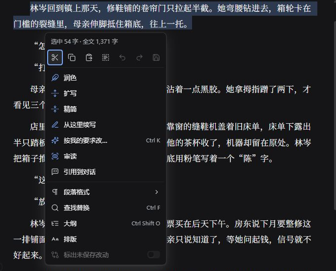
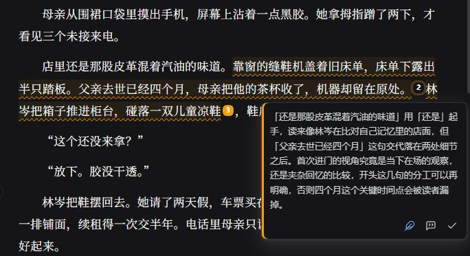

# 新编辑器：改稿、批注、采纳与保存

适用于 Scriptor **8.2.0** 和 DSH **0.2.0-rc.2**。截图于 2026-10-06 在当前版本的 Web 端拍摄。示例是原创短篇[《河埠旧事》](../maintenance/examples/河埠旧事.md)，改写建议和审读批注来自 DeepSeek 官方 API 的实际调用。

## 1. 打开正确的文件

1. 回到这本书的主会话。
2. 在“书房”里逐级展开目录。
3. 点击草稿、契约或资料。
   成功时，文档进入 DSH 标签页。先核对文件名和路径。尤其注意 `稿1.md`、`稿2.md` 这类版本。

可编辑的文件打开后，就可以在正文里修改。8.2.0 已经替换旧教程里的“阅读 / 编辑 / 改动”三模式。Markdown 标题等格式就地预览。frontmatter 元数据由保存器维护。

定稿、冻结内容或其他受保护文件会显示只读原因。它们可以阅读、复制、引用和发起审读。不能用排版、粘贴或改写来绕过保护。定稿修改仍走原来的更正流程。

## 2. 选区和右键菜单

1. 选中文字。
   成功时，出现浮动操作栏。
2. 右键，或点“更多”，打开完整菜单。

菜单上方说明当前选区或段落范围，并显示全文计数。把鼠标放在按钮上，可以查看名称和快捷键。

| 操作 | 用途 |
| --- | --- |
| 润色 | 保留事件与人物立场，调整表达 |
| 扩写 | 补充选定部分的描写或展开；应明确内容边界 |
| 精简 | 压缩重复表达，结果需核对 |
| 从这里续写 | 在当前插入位置提出后文候选 |
| 按我的要求改… | 说明具体要求，例如“保留对话，只压缩重复心理解释” |
| 审读 | 对原文提出批注，先保持文字不变 |
| 引用到对话 | 把原文和来源放入输入框，核对后自行发送 |

有选区时，操作作用在选区上。没有选区时，菜单会标明“当前段落”。请求发给当前主控，沿用已配置的模型，可能产生费用。局部编辑请求不会授权自动推进下一章，也不会改写其他章节。

## 3. 提交要求和取消等待

1. 选定正文后按 `Ctrl+K`，或选择“按我的要求改…”。
2. 输入要求，按 Enter 或发送按钮。
   续写也可以从光标附近的星形入口发起，并说明后文方向。

发送之后，原文附近显示等待或处理状态。主控忙碌时，请求可能先排队。

> [!CAUTION]
> 同一范围已经有请求时，不要重复提交。
> 点“取消这次请求”，改好要求再试。取消之后，迟到的结果不会再成为这次请求的可采纳建议。取消这一次，不等于中断主控的全部工作。要停止整段对话任务，仍使用 DSH 的停止操作。

## 4. 核对行内建议，再决定是否采纳

结果显示在原文附近。你可以**采纳、拒绝、换一版、在对话中查看**。聚焦当前建议时，`Tab` 采纳，`Esc` 拒绝，`Alt+]` / `Alt+[` 切换相邻建议。

先核对建议中的事实。图中模型把缝鞋机的位置从“靠窗”写成“墙角”。本次操作在采纳后手动改回“靠窗”，再保存为 `稿2.md`。建议显示成功，不等于内容全部正确。

续写先以灰字显示。等待期间，如果你改了相关原文，编辑器会要求你再核对块状差异，或者让失去有效位置的续写作废。先比较，再决定。这样可以保护你自己的新文字。

> [!IMPORTANT]
> 采纳只修改编辑缓冲区，还需要保存。
> `Ctrl+Z` 可以撤销采纳，重做可以恢复。最终以保存的内容为准。关闭整个 DSH 会丢失尚未完成的编辑器请求。重启之后，如果还需要，就重新发起。

## 5. 阅读审读批注

1. 点击原文旁边的批注标记，展开意见。
2. 可以按批注请求修改，也可以带着原文和批注去对话里讨论，或者关闭批注。
   只读文件不提供直接修改的入口。

局部编辑器里的审读，不等于整章审核已经完成。推进定稿时，仍要执行原来的章节审读、发现项处置和作者确认流程。

## 6. 保存和结果核对

1. 使用 `Ctrl+S` 或菜单“保存”。
   “标出未保存改动”显示相对当前基线的修改。标签上的未保存标记表示内容还没有落盘。

- **文件已保存**：磁盘已更新。草稿保存可能生成下一版。核对更新后的标签和路径。
- **版本已提交／无需提交**：Git 记录已完成，或不需要提交。失败时，使用保存提示里的“重试提交”。
- **已交给主控**：保存通知已送达。还要看主控随后的核对。不能直接理解成审核完成。

> [!NOTE]
> 提交或通知失败，不会自动撤回已经保存的正文。
> 按提示重试对应步骤。不要反复保存相同内容。

普通保存之后，要核对差异。如果涉及设定、事实或结构变化，主控会说明影响和等待决定的事项。

关闭文档时，留意未保存提示。先保存，或取消关闭。不要指望关闭之后一定能找回内容。暂时收起侧栏，和真正关闭文档，不是同一操作。

## 7. 外部修改和冲突

如果磁盘上的文件在别处被修改，编辑器会保留你未保存的文字，并提示比较。

1. 核对两份内容。
2. 按界面选择重新加载，或保留自己的编辑。
   保留自己的编辑时，新的磁盘版本成为保存基线。这不代表已经自动合并完成。

如果旧稿已经出现更新的版本，先打开新稿核对。不要反复从旧文件生成分支。更多说明见 [日常写作与恢复](workflows.md)。

## 8. 查找、大纲和排版

| 快捷键／菜单 | 功能 |
| --- | --- |
| `Ctrl+F` | 查找替换；只读文件不能替换 |
| `Ctrl+Shift+O` | 标题大纲 |
| `Ctrl+1` / `Ctrl+2` / `Ctrl+3` / `Ctrl+0` | 章标题、小节标题、三级标题、正文 |
| `Ctrl+B` / `Ctrl+I` | 选区加粗／楷体强调 |
| `Ctrl+Z` / `Ctrl+Shift+Z` | 撤销／重做 |
| 右键 → 排版 | 字体、字号、行距、栏宽、首行缩进等偏好 |

段落格式里的“场景分隔”会插入分隔标记。排版偏好主要影响显示。标题、强调等正文格式会改动文件，需要保存。布局允许时，可以互换对话和书稿的位置。收起或全屏时，以 DSH 的布局为准。

## 9. 全文字数与正文汉字数

菜单里的“全文”统计当前编辑内容中的非空白可读字符。它会去掉部分 Markdown 标记。**它含标点，也可能含候选事实段，以及尚未保存的修改。**

正式审读使用脚本 `正文统计.汉字数`。它读取磁盘上的当前待审稿，含章标题，排除 frontmatter、候选事实、标点、空白和英文字母。`字符数` 和 `非空白字符数` 是另外两种标明了口径的数字。两处数字不必相等。不要用编辑器的全文数来判断契约里的汉字范围。

旧项目请补充并确认作品契约的章节篇幅，然后再启用范围核对。见 [升级步骤与请求示例](upgrade-backup.md#旧项目需要更新作品契约)。越界是现有的文本规范发现项。可以修改，也可以由作者保留。没有新增审批步骤。
