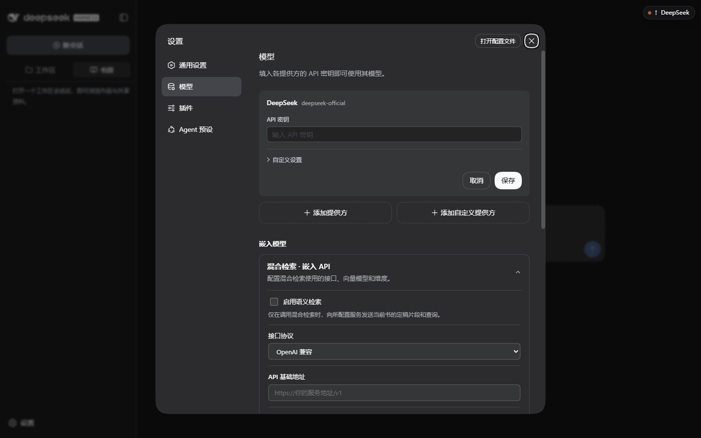
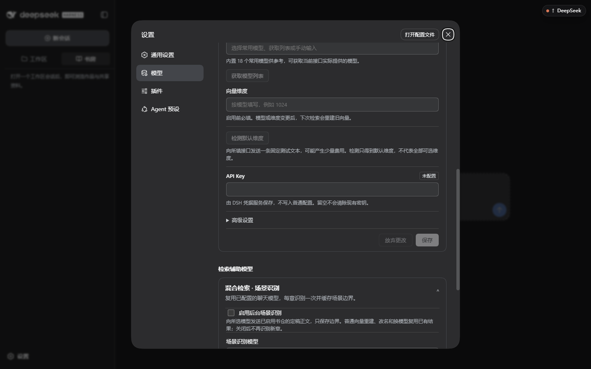
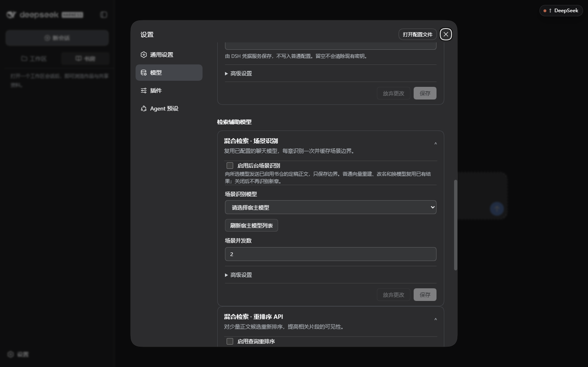
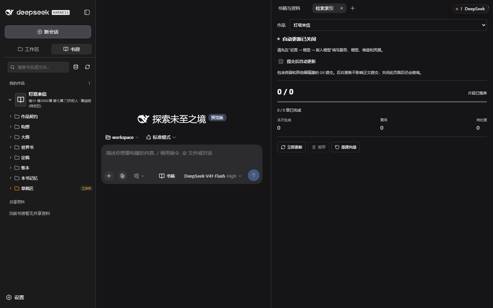

# 增强索引操作指南（混合检索）

增强索引让「检索已定稿内容」从关键词匹配升级为混合检索：**向量语义检索 + 场景边界 + 可选重排**。它是可选的——不配置也能完成构想、细纲、写作、审读、定稿与导出；配置后，涉及旧章节的检索与引用会更准。

三类配置分别填写；可以只启用向量检索。场景识别在后台索引流程中运行；当前查询重排用于混合检索候选，关键词降级时不会调用重排：

| 能力 | 依赖 | 不配时的行为 |
| --- | --- | --- |
| 语义检索（向量） | 一个兼容的嵌入服务、模型与维度 | 只用关键词检索定稿 |
| 场景识别 | 可用的后台嵌入索引配置，以及宿主已配置的聊天模型 | 按段落长度分块 |
| 查询重排序 | 已就绪的混合索引，以及重排接口与模型 | 保持原排序 |

## 0. 前提

- 安装时选择完整版 `@linfengqaqtat/dsh-scriptor-full@preview`，或单独安装 `webnovel-embedding-provider@0.0.8`（见 [最小可用配置](configuration.md)）。
- 有一个真实可用的嵌入服务（OpenAI 兼容或 Gemini 原生协议），并知道它的模型标识与向量维度。
- 嵌入服务会产生费用。先读 [隐私与费用](privacy.md)，确认发送范围可以接受。

## 1. 配置嵌入 API

**设置 → 模型 → 嵌入模型 → 混合检索 · 嵌入 API**：

| 字段 | 怎么填 | 注意 |
| --- | --- | --- |
| **启用语义检索** | 勾选并保存后生效 | 后台更新发送当前书的定稿切片；索引就绪后的检索发送查询文本 |
| **接口协议** | OpenAI 兼容 或 Gemini 原生 | 按服务方文档选，选错会直接请求失败 |
| **API 基础地址** | 服务的根地址，例如 `https://你的服务地址/v1` | 不要带具体路径或查询参数 |
| **向量模型** | 服务方给出的精确模型标识 | 可用「获取模型列表」向所填接口拉取；内置 18 个常用模型仅供参考 |
| **向量维度** | 与服务真实输出一致（**启用前必填**） | 「检测默认维度」会发送一条固定测试文本，可能产生少量费用，且只得到默认维度 |
| **API Key** | 该服务的密钥 | 由 DSH 凭据服务保存，不写入普通配置；留空不会清除现有密钥 |

填完点本卡片底部 **保存**，确认「未保存」提示消失、没有错误。场景识别与重排卡片各有自己的保存按钮，也要分别保存。

模型或维度改过之后，旧向量不再适配新配置：已开启自动更新的书由后台重新生成；未开启时去索引面板点 **立即更新**。**查询不会现场重建全书向量**，新索引未就绪时会说明原因并退回关键词检索。重新生成会消耗嵌入额度，改配置前先确认费用。

## 2. 可选：场景识别

**混合检索 · 场景识别** 复用你已配置的聊天模型，每章识别一次并缓存场景边界：

| 字段 | 说明 |
| --- | --- |
| **启用后台场景识别** | 开启后才会向所选模型发送已启用书仓的定稿正文；**只保存边界**，不保存正文副本 |
| **场景识别模型** | 从宿主已配置的聊天模型里选；用「刷新宿主模型列表」同步新增的模型 |
| **场景并发数** | 同时识别的章节数；调高更快，但更容易触发服务方限流 |

普通向量重建、书改名、换模型都会复用已有识别结果；关闭后不再识别新章。

## 3. 可选：重排序

**混合检索 · 重排序 API** 在查询时对少量候选正文重新排序：

| 字段 | 说明 |
| --- | --- |
| **启用查询重排序** | 查询时向本接口发送问题与候选正文；**不参与索引重建** |
| **完整重排接口地址** | 重排服务的完整地址（与嵌入地址可以不同） |
| **重排序模型** | 服务方给出的精确标识 |
| **重排候选数** | 参与重排的候选条数；越大越慢 |
| **重排等待时间（秒）** | 默认 30 秒，最长 120 秒；超时后使用原排序 |
| **重排 API Key** | 由凭据服务保存，普通配置只保留引用 |

服务失败时使用原排序，并返回降级原因——**降级不等于获得了模型增强效果**。

## 4. 在书里运行索引

打开方式：**书房 → 查看检索索引**（右侧面板出现「检索索引」标签）。

### 面板元素

| 元素 | 说明 |
| --- | --- |
| **作品** | 选择要查看索引的书；只列出当前工作范围里可用的作品 |
| **状态行** | 见下方状态表 |
| **提交后自动更新** | 勾选会启动更新，并持续跟踪提交与配置变化；未勾选时可手动点「立即更新」 |
| 「包含终端和其他编辑器的 Git 提交」 | 在终端或别的编辑器里提交的定稿同样会被纳入；后台更新不影响正文提交，关闭本页面后仍会继续 |
| **片段已落库 x / y** | 已写入索引的切片数 / 总切片数 |
| **x / y 章已完成** | 已完成的章节数 |
| **本次生成 / 复用 / 待处理** | 本次真正调用嵌入服务的数量、命中缓存复用的数量、还没处理的数量 |
| **场景识别 x / y 章** | 场景边界识别进度，含新识别 · 复用 · 回退段落与所用场景模型 |
| **嵌入模型 / 向量维度** | 当前生效的模型与维度，用来核对是否和配置一致 |
| **目标提交 / 已同步** | 目标提交是后台正在追踪的提交，已同步是处理完的提交；不同表示还要校准，设计等非正文提交也可能触发检查，不一定增加切片 |
| **异常来源（n）** | 扫描时跳过的文件与原因（例如格式不合法、非普通文件） |
| **最近诊断（n）** | 最近若干次失败的尝试与错误信息 |

### 状态表

| 状态 | 含义 | 你该做什么 |
| --- | --- | --- |
| 自动更新已关闭 | 没勾「提交后自动更新」 | 想省额度就保持关闭，需要时点「立即更新」 |
| 等待配置嵌入模型 | 嵌入服务未配置或未启用 | 回到设置 → 模型 → 嵌入模型补全 |
| 等待后台处理 | 已排队 | 等待即可，也可「暂停」 |
| 正在校准定稿 | 正在扫描定稿目录 | 等待 |
| 正在识别场景 | 正在调场景模型 | 等待；限流时降低场景并发数 |
| 正在生成向量 | 正在调嵌入服务 | 等待；这一段最费额度 |
| 等待自动重试 | 失败后进入退避重试（显示第几次、剩余秒数） | 等待，或先修配置 |
| 已暂停 | 你点了「暂停」 | 处理完后点「继续」 |
| 索引已同步 | 目标提交与已同步一致 | 无需操作 |
| 索引需要处理 | 失败达到上限或配置错误 | 看「最近诊断」，修好后「立即重试」 |

### 按钮

| 按钮 | 作用 | 何时用 |
| --- | --- | --- |
| **立即更新 / 立即重试** | 立刻跑一次增量更新；失败或未配置状态下文案变为「立即重试」 | 关闭自动更新后手动补索引；修完配置后重试 |
| **暂停 / 继续** | 暂停后台索引，保留已完成的进度 | 想先写完本章、或者要省额度时 |
| **重建向量** | 重新生成该作品全部定稿的向量 | 换嵌入模型或维度、或怀疑向量损坏时 |
| **重新识别场景** | 重新调用场景模型；可填「重新识别章号」只重做单章，留空为全书 | 改了章节切分、或某章场景识别结果明显不对时 |

**重建向量与重新识别场景的区别**：前者只重算向量，**场景边界会保留**；后者会重新调用场景模型，并更新受影响的向量。两个操作都会弹确认框，确认前先看清书名与范围。

「重建向量」会重新消耗嵌入额度；更换模型/维度也可能需要全量生成。「重新识别场景」会消耗聊天模型额度，边界变化后受影响切片还可能再次产生嵌入费用。暂停保留已完成进度，但不能撤销服务端已经收到并计费的请求。

## 5. 数据流与费用边界

| 动作 | 发出去的内容 | 消耗 |
| --- | --- | --- |
| 索引就绪后的混合检索 | 你的查询文本；本地已有的定稿向量不在查询时重新生成 | 嵌入服务 |
| 后台索引更新 | 定稿正文切片 | 嵌入服务 |
| 场景识别 | 已启用书仓的定稿正文（只保存边界） | 聊天模型 |
| 查询重排序 | 你的问题与候选正文片段 | 重排服务 |
| 「检测默认维度」 | 一条固定测试文本 | 少量 |

本页图片只实拍了配置入口与未配置的索引面板；运行中状态表和按钮说明依据当前源码，不代表已进行真实服务调用验收。

草稿区内容不参与索引；未定稿内容不会因为索引而外发。完整边界与关闭方式见 [隐私与费用](privacy.md)。

## 6. 失败与降级

- **重排失败**：使用原排序，并在界面给出降级原因。
- **场景识别失败**：该章回退为按段落分块，进度里计入「回退段落」。
- **嵌入失败**：进入自动重试（显示第几次、剩余秒数）；超过上限后变成「索引需要处理」。
- **诊断去向**：面板会显示「诊断已交给所属主会话」；若主会话不在，则「诊断已保留，等待所属主会话接收」，不会静默丢弃。

## 7. 常见问题

| 现象 | 原因与处理 |
| --- | --- |
| 一直停在「等待配置嵌入模型」 | 嵌入服务未填、未勾「启用语义检索」，或向量维度为空 |
| 「索引已同步」但检索仍不理想 | 检查场景识别与重排是否启用；必要时「重建向量」或「重新识别场景」 |
| 目标提交与已同步长期不一致 | 自动更新已关闭；点「立即更新」，或勾上自动更新 |
| 换模型后报维度不一致 | 同步更新「向量维度」，然后「重建向量」 |
| 频繁进入等待自动重试 | 服务方限流或密钥额度不足；降低场景并发数、错峰更新，或先暂停 |

配置入口和主模型在同一页（设置 → 模型），排查维度问题时可以查 [模型维度表](../../packages/embedding-provider/MODEL_DIMENSIONS.md)。
