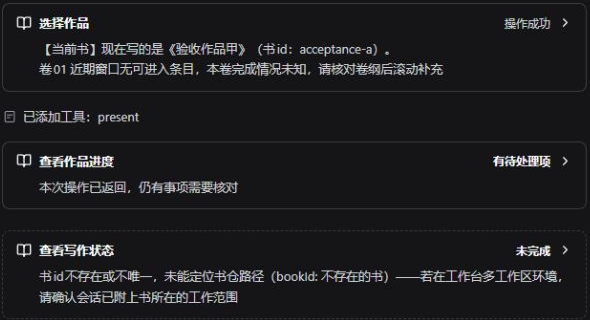
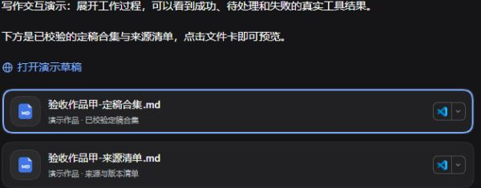
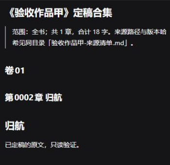
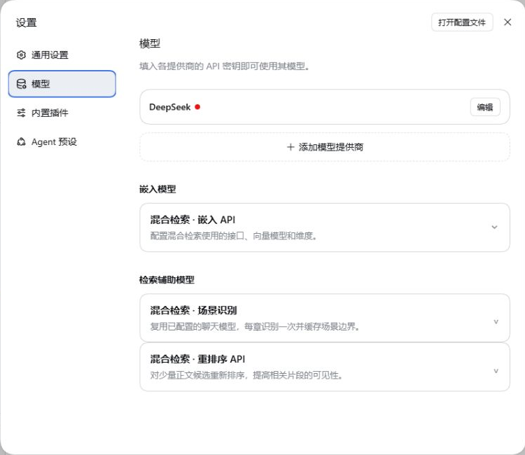
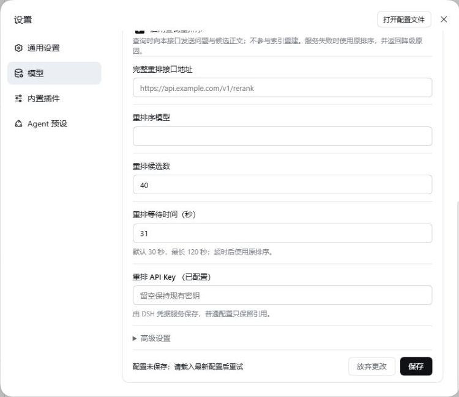
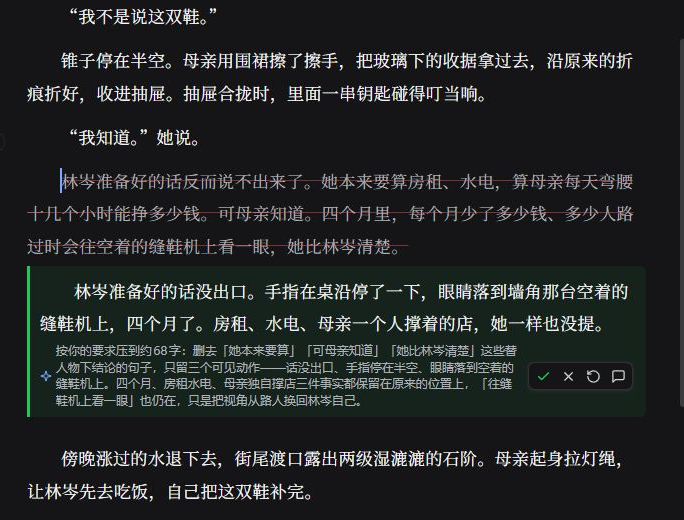

# 结果卡与导出成品（DSH 0.2）

本页适用于 **Scriptor 8.2.0** 和 **DSH 0.2.0-rc.2**。文件卡和导出成品见下文。新编辑器的行内建议、批注、采纳和保存见 [编辑器教程](editor.md)。

## 阅读操作结果

对话里的小说工具显示中文名称。

1. 点击标题，展开结果。
2. 再打开“原始参数与结果”，查看完整记录。

如果 DSH 折叠了工作过程，先展开“用时…”和“已调用工具”。成品卡在回复下方。不需要展开工具过程才能看到它。

| 状态 | 含义和下一步 |
| --- | --- |
| 准备中 / 进行中 | 参数仍在生成，或工具尚未返回。这不表示文件已经保存 |
| 操作成功 | 这次工具返回成功。不代表整个章节流程已经完成 |
| 有待处理项 | 工具已返回，但还有待回写模块、审核问题、设计内容问题或计划待核对项。展开后看具体结果 |
| 无变化 | 这次设计提交没有新变化。不需要重复调用来补提交 |
| 未完成 / 执行异常 | 阅读失败原因。文件可能已经部分落盘。先核实，再决定是否重试 |
| 已中断 | 核对现有文件和记录之后再继续。不要把取消当成自动回滚 |
| 待核对 | 无法可靠识别结果结构。保留原始信息。不要自动判断成功 |

审读卡把“模块回写”和“审核”分开显示。全部模块都回写了，不等于问题已经处置。有待处理项时，仍要完成对应的核对。进度卡来自该次查询结果。历史卡片不会自动变成当前书仓状态。需要最新状态时，重新查询。

书房编辑器的保存反馈仍有各自的含义。“文件已保存”“版本已提交”“已交给主控”表示不同步骤。只有主控实际读取并报告之后，才算核对完成。

## 导出并打开成品

1. 指定作品、卷或章节范围，以及一个新的目标目录。
   导出固定包含定稿合集和来源清单。
2. 确认文件名、范围和落点。
   工作台用原生文件工具写盘。
3. 工作台重新读取这两份实际文件，并核对哈希。
   成功时，用 DSH 的成品卡交付。
4. 点击文件卡，用 DSH 提供的打开方式查看当前文件。
   来源清单记录章节路径、版本和哈希，供以后回查。

> [!NOTE]
> 目标目录里如果已有同名文件，不会覆盖。请另选目录。
> 校验失败时，不会把它交付为成功成品。文件已经生成并且校验成功，但卡片创建失败时，会明确给出路径。不必为了补一张卡片而再次导出。

卡片记录的是文件位置，不是历史内容的副本。移动、删除或修改源文件，会影响以后打开的内容。要保留某次导出，就保留整批合集和清单。

## 新版 DSH 入口

嵌入、场景识别和重排序位于 **设置 → 模型** 页的下方。分别展开“嵌入模型”和“检索辅助模型”卡片。这一轮没有把它们搬到插件管理页。

- 左侧“插件”管理已经安装的组合包。安装完成之后，核对启用状态。安装成功不等于模块已经加载。
- 检索的嵌入、场景和重排配置仍然互相独立。失败时保留草稿，并按提示处理配置冲突。
- “自动化任务”是官方的可选插件。需要提醒时再开启。关闭它不会删除已保存的任务。它不是自动定稿或自动连写的授权。
- Windows 的文件定位、浮动面板，以及 Office/PDF 的文字选区，由 DSH 提供。小说的编辑保存和版本保护仍由书房处理。

配置保存失败时，展开状态，草稿会保留。先核对地址、模型和必填项。如果有并发修改，载入最新配置再重试。下图是隔离环境里故意缺少重排接口时的反馈。当时没有启用，也没有发送任何外部请求。

## 统一文件标签与自动刷新

书房目录和对话中的书稿链接，进入 DSH 的原生文件标签。文件图标、标签栏、分栏和打开方式由 DSH 提供。书房范围内的书稿和共享资料使用新的直接编辑界面，支持选区改写、行内建议、批注、保存和引用。书房范围外的普通文件、演示导出合集和 PDF，继续使用原生预览。同一个文件反复打开时会复用标签。草稿保存生成新版本时，当前标签跟随到新稿。

新界面的具体操作见 [编辑器教程](editor.md)。

目录监听当前工作范围和已经展开的目录。新增或删除文件之后，目录会自动更新。重新展开目录也会读取最新列表。正在打开的正文发生外部变化时：

- 没有未保存的修改：自动更新正文。
- 有未保存的修改：保留你的文字，并提示“磁盘内容已变化”。比较之后，可以载入磁盘版本，或保留编辑。
- 保存正在进行，或结果尚未确认：不覆盖缓冲。先完成原来的保存，或重试原来的保存。

“刷新书房”现在同时重读目录和已打开的正文，并沿用上面的保护。原生文件标签的重新读取也会更新书稿。目录监听不可用时，会提示你手动刷新。

关闭原生标签，会保留当前会话内的编辑缓冲。再次打开文件可以继续。未保存的修改显示圆点。退出页面时仍会提醒。缓冲不等于已经保存到磁盘。不能靠它在应用重启之后保留内容。

> [!NOTE]
> 外部变动只更新界面，不向主控发送通知。
> 是否增加这个能力，尚未决定。在书房里主动保存之后，现有通知保持不变。

## 升级与安装

8.2.0 配套 DSH 0.2.0-rc.2。

1. 升级前，备份作品和 profile。
2. 停止会话。
3. 按 [升级说明](upgrade-backup.md) 更新插件，并补充旧项目的契约篇幅。
4. 先在作品副本上核对书房、编辑器和文件卡。
   成功时，副本里的书房、编辑器和文件卡都能打开。
