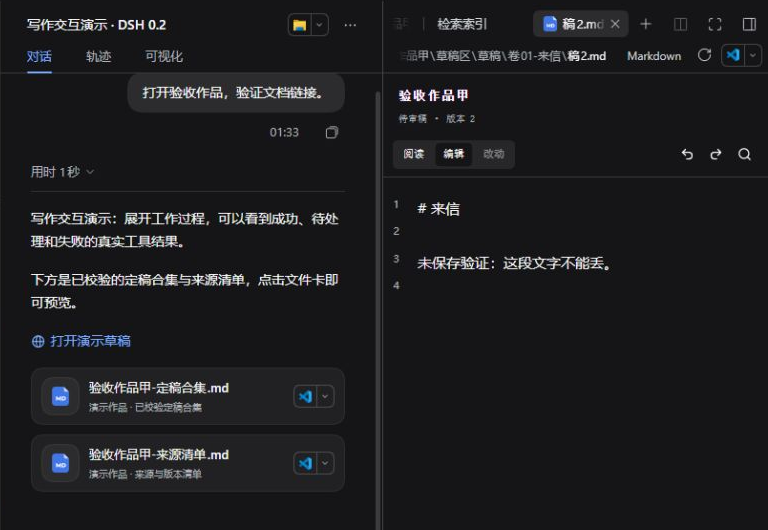

# 结果卡与导出成品（DSH 0.2）

本页适用于 **Scriptor 8.0.0** 与 **DSH 0.2.0-rc.2**，包含原生草稿文件卡、书稿编辑与导出成品。

## 阅读操作结果

对话中的小说工具显示中文名称。点击标题展开结果，再打开“原始参数与结果”查看完整记录。

若宿主折叠了工作过程，先展开“用时…”和“已调用工具”。成品卡位于回复下方，不需要展开工具过程。

| 状态 | 含义和下一步 |
| --- | --- |
| 准备中 / 进行中 | 参数仍在生成或工具尚未返回，不表示文件已经保存 |
| 操作成功 | 本次工具返回成功；不代表整个章节流程已经完成 |
| 有待处理项 | 工具已返回，但还有待回写模块、审核问题、设计内容问题或计划待核对项；展开看具体结果 |
| 无变化 | 本次设计提交没有新变化，不需要重复调用来补提交 |
| 未完成 / 执行异常 | 阅读失败原因；文件可能已部分落盘，先核实再决定是否重试 |
| 已中断 | 核对现有文件和记录后继续，不把取消当作自动回滚 |
| 待核对 | 无法可靠识别结果结构，保留原始信息，不自动判断成功 |

审读卡的“模块回写”和“审核”分开显示。全部模块回写不等于问题已经处置；有待处理项时仍需完成对应核对。进度卡来自该次查询结果，历史卡片不会自动变成当前书仓状态；需要最新状态时重新查询。

书房编辑器的保存反馈仍有独立含义：“文件已保存”“版本已提交”“已交给主控”分别表示不同步骤，只有主控实际读取并报告后才算核对完成。

## 导出并打开成品

1. 指定作品、卷/章节范围和新的目标目录。导出固定包含定稿合集与来源清单。
2. 确认文件名、范围和落点，工作台用原生文件工具写盘。
3. 工作台重新读取两份实际文件并核对哈希，通过后用宿主的成品卡交付。
4. 点击文件卡使用宿主提供的打开方式查看当前文件。来源清单记录章节路径、版本与哈希，供回查。

目标目录已有同名文件时不覆盖，另选目录。校验失败不会交付为成功成品。文件生成和校验成功、但卡片创建失败时，会明确提供路径；无需为了补卡片再次导出。

卡片记录的是文件位置，不是历史内容副本。移动、删除或修改源文件会影响以后打开的内容；要保留某次导出，保留整批合集和清单。

## 新版宿主入口

嵌入、场景识别与重排序位于 **设置 → 模型** 页下方，分别展开“嵌入模型”和“检索辅助模型”卡片；本轮没有把它们搬到插件管理页。

- 左侧“插件”管理已安装的组合包；安装完成后核对启用状态，安装成功不等于模块已加载。
- 检索的嵌入、场景与重排配置仍相互独立；失败时保留草稿，按提示处理配置冲突。
- “自动化任务”是官方可选插件。需要提醒时再开启，关闭不删除已保存任务；它不是自动定稿或自动连写授权。
- Windows 文件定位、浮动面板与 Office/PDF 文字选区由宿主提供。小说编辑保存和版本保护仍由书房处理。

配置保存失败时，展开状态和草稿保留。先核对地址、模型和必填项；有并发修改时载入最新配置再重试。下图是隔离环境故意缺少重排接口时的反馈，未启用或发送任何外部请求。

## 统一文件标签与自动刷新

书房目录、对话中的书稿链接现在进入 DSH 原生文件标签。文件图标、标签栏、分栏和打开方式由 DSH 提供；书房范围内的书稿和共享资料在同一个 Markdown/文本标签中增加“阅读 / 编辑 / 改动”、保存和引用功能。书房范围外的普通文件、演示导出合集和 PDF 继续使用原生预览。同一文件反复打开会复用标签，草稿保存生成新版本时当前标签跟随到新稿。

目录监听当前工作范围和已展开目录，新增或删除文件后自动更新；重新展开目录也会读取最新列表。正在打开的正文发生外部变化时：

- 没有未保存修改：自动更新正文。
- 有未保存修改：保留你的文字，提示“磁盘内容已变化”，可比较后载入磁盘版本或保留编辑。
- 保存正在进行或结果尚未确认：不覆盖缓冲，先完成或重试原保存。

“刷新书房”现在同时重读目录和已打开正文，并沿用上述保护。原生文件标签的重新读取也会更新书稿。目录监听不可用时会提示手动刷新。

关闭原生标签保留当前会话内的编辑缓冲，再次打开文件可以继续；未保存修改显示圆点。退出页面仍会提醒，缓冲不等于磁盘保存，不能依赖它跨应用重启保留。

**外部变动只更新界面，不向主 Agent 发送通知。** 是否增加该能力尚未决定。在书房主动保存后的现有通知保持不变。

## 升级与安装

先备份并停止实例，使用与本开发版本匹配的本地构建包在新 profile 验证。只有拿到正式的新版本发布说明后，才按该说明升级日常环境；不要直接把 8.0.0 的宿主替换为 0.2 来获取新卡片。当前任务的演示只使用临时作品与隔离 profile，不迁移个人会话。
