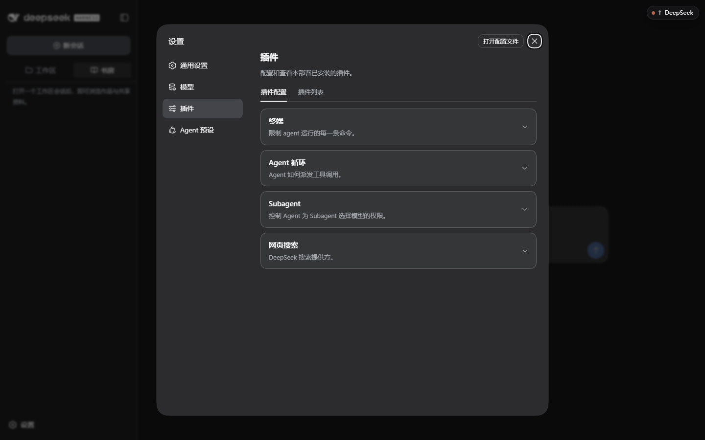
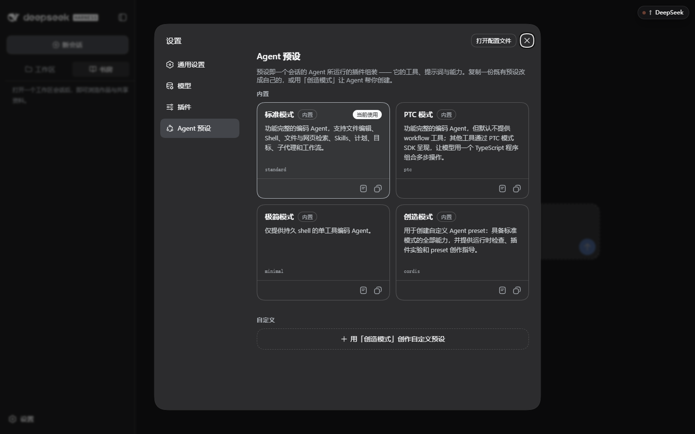

# 界面与按钮参考

这一页逐块说明工作台界面元素的用途与使用时机。界面截图取自当前预览版；按钮文案以小字说明为准，宿主更新后可能微调。

## 主界面分区

| 区域 | 位置 | 作用 |
| --- | --- | --- |
| 导航栏 | 最左 | 新会话、工作区／书房切换、会话搜索、设置入口 |
| 对话区 | 中间 | 与 Agent 的会话；输入框在底部 |
| 右侧面板 | 右侧（随会话打开） | 书稿与资料、检索索引等文档与状态面板 |

底部一行显示当前工作目录，鼠标悬停可看到完整路径；它同时也是「这台工作台只能改这里」的提示。

## 左侧导航

| 元素 | 用途 | 使用时机 |
| --- | --- | --- |
| **新会话** | 开一个空白会话 | 换任务或换书时；旧会话仍在列表里 |
| **收起侧边栏** / 展开按钮 | 让出横向空间给正文 | 对照长文或看可视化时 |
| **工作区** 标签 | 列出工作区与会话 | 在多个会话间跳转 |
| **书房** 标签 | 浏览作品与共享资料 | 读稿、找文件、看作品状态 |
| **搜索会话…** | 按标题过滤会话 | 会话变多后定位 |
| **设置** | 打开设置对话框 | 配置模型、权限、外观、插件、预设 |

会话标题右侧的 ● 表示有未保存的编辑内容；会话列表里的标签用于区分工作区。

## 输入框与按钮

| 元素 | 用途 | 说明 |
| --- | --- | --- |
| **工作区选择器** | 选择／切换本会话的工作目录 | 首次使用必须显式选择，工作台不会默认接管任意目录 |
| **模式（标准模式等）** | 选择 Agent 预设 | 预设决定工具与提示词；默认标准模式即可写作 |
| **+** | 添加附件到当前消息 | 图片、文本、日志 |
| **指令（/）** | 调出指令菜单 | 会话控制类命令 |
| **访问模式（工作区内修改）** | 当前沙箱权限档位 | 决定 Agent 能在工作区里做多少改动；调宽前先确认影响范围 |
| **书稿** | 打开右侧「书稿与资料」面板 | 需要一边看正文一边对话时 |
| **模型选择器** | 当前主模型与推理等级 | 只影响本会话；请在设置 → 模型中先把服务配好 |
| **发送** | 提交消息（忙碌时按设置排队或打断） | 见「通用设置 → 繁忙时的发送行为」 |

## 书稿与资料（右侧面板）

| 元素 | 用途 |
| --- | --- |
| 文档标签页 | 一个文档一个标签，● 表示有未保存修改 |
| 书名 / 相对路径 | 明确这段正文属于哪本书的哪个文件 |
| **版本** | 该文档当前的版本号，便于和提交历史对照 |
| **阅读 / 编辑 / 改动** | 只读查看、直接编辑、查看差异 |
| 「定稿更正通过吃书补偿流程处理」 | 已定稿正文的事实性修改要走补偿流程留痕 |
| **引用到对话** | 把当前内容作为引用交给 Agent |
| **字数** | 当前文档字数统计 |
| **保存** | 写回磁盘；关闭标签后未保存内容可重新打开继续编辑 |

直接编辑适合改错别字、行文小修；改变设定、事实或章节结构请回到对话里说清楚，让工作流留下相应记录。

## 书房

| 元素 | 用途 |
| --- | --- |
| **搜索书名或文件** | 在作品与文件树里定位条目 |
| **查看检索索引** | 打开「检索索引」面板（见 [增强索引](enhanced-index.md)） |
| **刷新书房** | 重新扫描工作区；在终端或外部编辑器改过文件后用 |
| **我的作品** | 作品卡片列表；卡片副标题给出卷章进度或需要处理的提示 |
| **文件树** | 作品契约／构想／大纲／世界书／定稿／账本／本书记忆／草稿区，逐级展开到文件 |
| **共享资料** | 工作区级别的共享文件，不属于某一本书 |
| 底部路径 | 当前工作区根目录 |

草稿区右侧的「工作中」徽标表示草稿区尚有进行中的内容，不代表已定稿。

## 工作区标签页

列出工作区与其下的会话，用于在工作区之间切换、回到旧会话。与书房可以并存：左侧看会话、右侧看稿。

## 可视化

会话视图里的「可视化」以作品为单位展示两类视图：

- **章节进度**：各卷章节的推进情况。
- **时间线关系图谱**：依据账本时间线里的落点与人物条目标出关联。

面板顶部可**选择可视化作品**、**刷新作品视图**；没有可用作品时会提示「当前工作范围暂无作品。」。适合在写卷中段核对「哪些章已定稿、哪些线索还没回收」。它只读，不会改动书稿。

## 检索索引（右侧面板）

列出当前书的索引进度、暂停／重试与错误信息。逐项说明见 [增强索引操作指南](enhanced-index.md)。

## 设置

| 分区 | 内容 | 说明 |
| --- | --- | --- |
| **通用设置** | 权限、语言、外观、字号大小、对话显示、繁忙时的发送行为 | 只改新会话默认值或显示偏好，不改作品文件 |
| **模型** | 提供方卡片、嵌入模型、检索辅助模型 | 见 [最小可用配置](configuration.md) 与 [增强索引](enhanced-index.md) |
| **插件** | 插件配置／插件列表 | 查看本部署已安装的插件与其可调项 |
| **Agent 预设** | 内置标准／PTC／极简／创造模式，可查看、复制、设为默认 | 预设决定工具与提示词；不确定就保持标准模式 |

「打开配置文件」直接打开该 profile 的配置文件；手工编辑前先备份，并在改完后重新启动工作台确认加载成功。

## 状态与徽标速查

| 显示 | 含义 |
| --- | --- |
| 标签页上的 ● | 有未保存的编辑内容 |
| 文件树「工作中」 | 草稿区仍有进行中的内容 |
| 作品卡片副标题 | 当前卷的进度或需要核对的提示（例如近期窗口没有可进入条目） |
| 检索索引状态行 | 见 [增强索引](enhanced-index.md) 的状态表 |
| 输入框右侧模型名 | 本会话使用的主模型与推理等级 |