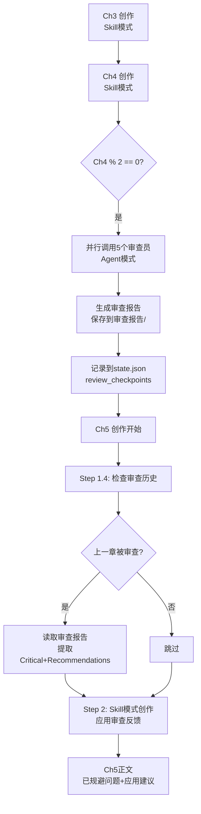

# 回滚完成报告

> **执行日期**: 2026-01-01
> **Git Commits**: 000469f + c6dbec0
> **回滚原因**: 基于 Crucible 官方实践和 Gemini 深度分析

---

## ✅ 回滚操作完成

### 已删除文件
- ❌ `.claude/agents/chapter-writer.md` (271 行)

### 已修改文件
- ✅ `.claude/commands/webnovel-write.md` Step 2（改回 Skill 模式）

### 已保留功能（重要改进）
- ✅ Step 1.4: 加载审查反馈（条件性）
- ✅ Step 7: 审查报告保存 + state.json 记录

---

## 🎯 为什么要回滚？

### Gemini 的核心论点（基于 Crucible 源码）

#### 1. Crucible 官方实践
```
Write (创作): Skill 模式（主对话中直接生成）
Review (审查): Agent 模式（Task 工具调用 5 个 agents）
```

**官方源码引用**：
> "Activates the crucible-writer skill... Writes scene-by-scene"
> "Use the Task tool with the 5 review agent subagent_types"

#### 2. 交互性需求（最致命的问题）

**Agent 模式的问题**：
```
用户: /webnovel-write 4
→ 调用 chapter-writer agent
→ Agent 在独立上下文中写作...（黑盒）
→ 用户想说："等等，慕容雪这段性格不对，改一下"
   ❌ 无法打断！Agent 已经在运行中
→ Agent 写完 3000 字 → 返回结果
→ 用户："这段剧情太拖沓，重写"
   ❌ 必须整个 Agent 重新调用（浪费时间）
```

**Skill 模式的优势**：
```
用户: /webnovel-write 4
→ 主对话加载 webnovel-writer skill 知识
→ 主模型开始逐段写作（用户实时可见）
→ 主模型："我打算写慕容雪主动表白..."
→ 用户："不，太快了，改成含蓄暗示"
   ✅ 主模型立即调整："好的，我改成眼神交流"
→ 生成的章节更符合用户期望
```

#### 3. 上下文学习能力

**Agent 模式**：
```
第一次: 用户说"多写心理描写，少点动作戏"
第二次: ❌ Agent 忘记了，必须重新传递偏好
```

**Skill 模式**：
```
主对话中，所有用户反馈都在上下文：
- "这次多加点幽默感"
- "慕容雪性格要温柔一点"
- "战斗场面不要太血腥"

✅ 主模型记住所有偏好
✅ 越写越贴合用户风格
```

#### 4. 流程简洁性

**Agent 模式问题**：
```
chapter-writer agent (allowed-tools: Read, Write)
├─ Phase 1-5: 创作章节 ✅
└─ 但它无法调用 Python 脚本 ❌

导致流程割裂：
Step 2: Agent 创作章节
Step 3-7: 主对话调用脚本（extract_entities, update_state, backup）
```

**Skill 模式优势**：
```
主对话中：
Step 1: 加载上下文
Step 2: 创作章节（Skill 自动加载知识）
Step 3-7: 调用脚本

✅ 流程清晰
✅ 职责单一
✅ 无需复杂权限配置
```

---

## 📊 最终架构（符合官方最佳实践）

```
webnovel-write.md (Command)
├─ Step 1: 主对话加载上下文 + 审查反馈 ✅
├─ Step 2: 主对话创作章节（Skill 自动加载知识）✅
├─ Step 3-6: 主对话调用 Python 脚本 ✅
└─ Step 7: 主对话调用 5 个 review agents ✅
```

**职责分工**：
- **主对话**：创作（Skill 模式）+ 交互 + 脚本调用
- **后台 Agents**：审查（5 个 reviewers，客观隔离）
- **后台 Scripts**：状态管理 + Git 备份

---

## ✅ 保留的改进（审查反馈闭环）

### Step 1.4: 加载审查反馈（新增，保留）

**触发条件**：`(chapter_num - 1) % 2 == 0`（上一章被审查过）

**执行流程**：
1. 读取 `state.json.review_checkpoints`
2. 找到最新审查报告路径
3. 提取 🔴 Critical Issues + 💡 Top 3 Recommendations
4. 准备反馈摘要（传递给 Step 2）

**示例输出**：
```
📋 Review Feedback Loaded (From Ch3-4 Report):

🔴 Critical Issues to Avoid:
  - 连续3章打脸型爽点（需变化爽点类型）
  - Quest线已连续5章主导（需切换到Fire或Constellation）

💡 Priority Recommendations:
  1. 增加Fire线（慕容雪情感戏）比重
  2. 爽点类型建议：升级型 or 收获型
```

### Step 2: Skill 模式创作（修改，包含反馈应用）

**新增"审查反馈应用"逻辑**：

```markdown
**Context to Apply** (from Step 1):
...
4. **Review Feedback** (if loaded in Step 1.4 - CRITICAL):
   - 🔴 **Critical Issues to AVOID**: [从审查报告提取的问题]
   - 💡 **Recommendations to APPLY**: [从审查报告提取的Top 3建议]

**Generation Process**:
1. **Pre-Writing Planning** (think before writing):
   - 审查反馈应用: [如何规避Critical Issues + 应用Recommendations]

2. **Content Generation**:
   - ✅ Apply review feedback (avoid Critical Issues)

4. **Self-Review** (before saving):
   - [ ] Review feedback applied (if exists)?
```

### Step 7: 审查报告保存（增强，保留）

**新增功能**：
- Step 7.1: 汇总 5 个审查员报告 → 保存到 `审查报告/Review_Ch{N-1}-{N}_YYYYMMDD.md`
- Step 7.2: 更新 `state.json.review_checkpoints`
- Step 7.3: 向用户展示摘要

---

## 🔁 完整的反馈闭环（保留）



**关键点**：
- ✅ 主对话创作（Skill 模式，高频交互）
- ✅ Agent 审查（隔离上下文，客观性）
- ✅ 审查反馈自动应用（防止问题累积）

---

## 📝 Git 历史

```bash
c6dbec0 chore: 清理已删除的 chapter-writer.md
000469f revert: 回滚 Agent 化创作流程，改回 Skill 模式
2ad7b60 feat: Agent化创作流程 + 审查反馈闭环（已回滚）
```

---

## 🎉 总结

✅ **回滚完成**：删除 chapter-writer agent，Step 2 改回 Skill 模式

✅ **保留改进**：
- Step 1.4: 加载审查反馈
- Step 7: 保存审查报告 + state.json 记录
- 完整的反馈闭环机制

✅ **符合官方实践**：
- 创作 = Skill 模式（Crucible 官方设计）
- 审查 = Agent 模式（Crucible 官方设计）

✅ **架构优势**：
- 高频交互（用户随时调整）
- 上下文学习（记住用户偏好）
- 流程简洁（职责清晰）

---

**最终架构已就绪，符合官方最佳实践！**
