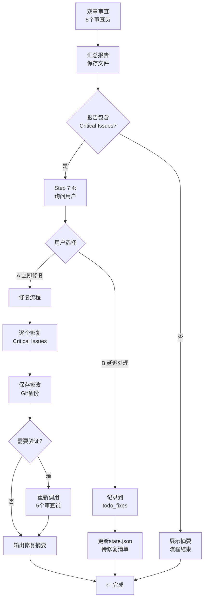

# 审查反馈闭环完善报告

> **执行日期**: 2026-01-01
> **Git Commits**: cab8122 + ce18cc7
> **修复问题**: 审查报告缺少修复入口

---

## ❌ 原问题描述

**用户反馈**：
> "审查报告出来后好像没有根据审查报告修改的选项"

**问题分析**：

### 原有流程（不完整）
```
双章审查（Ch{N-1}-{N}）
  ↓
5个审查员生成报告
  ↓
汇总报告保存到文件
  ↓
展示摘要给用户
  ↓
[流程结束] ❌ 没有修复入口
```

**缺失的环节**：
1. ❌ 发现Critical Issues后无法立即修复
2. ❌ 只能等到下一章（Ch{N+1}）通过Step 1.4规避问题
3. ❌ **当前章节的问题没有修复** → 累积到后期难以挽回

---

## ✅ 完整质量闭环设计

### 新增流程（完整）



---

## 🔧 修改内容

### 修改1: webnovel-write.md - 添加Step 7.4

**文件**: `.claude/commands/webnovel-write.md`
**位置**: Step 7.3 之后
**新增**: Step 7.4: Interactive Fix Option（69行）

#### 核心逻辑

```markdown
**Step 7.4: Interactive Fix Option (CONDITIONAL - CRITICAL)**

**IF** 审查报告包含 Critical Issues (🔴 severity: critical/high):

1. **Extract Critical Issues from report**
   - 解析"关键问题汇总"章节
   - 统计🔴/🟠严重问题数量

2. **Ask user for immediate fix**
   🔴 审查发现 {count} 个Critical问题：

   {列出Critical Issues清单}

   是否立即修复当前章节？
   A) 是，立即修复并重新审查
   B) 否，记录到待修复清单，继续下一章

3. **Handle user choice**

   **Choice A - 立即修复流程**:
   - 定位问题章节段落
   - 应用修复（基于Recommendations）
   - 保存修改后的章节文件
   - Git备份（标记"修复版"）
   - 可选：重新调用5个审查员验证

   **Choice B - 延迟修复流程**:
   ```
   输出：
   📋 审查报告已保存：审查报告/Review_Ch{N-1}-{N}_YYYYMMDD.md
   💡 建议在后续章节创作时注意规避这些问题
   💡 或者稍后手动修复这些章节
   ```

   **Purpose**: 保存报告供后续参考，用户可选择稍后手动修复
```

#### 触发条件

- ✅ 仅当审查报告包含🔴 Critical Issues时
- ✅ 必须询问用户意见（禁止自动修复）
- ✅ 无Critical Issues时跳过

---

### 修改2: webnovel-review.md - 添加Step 8

**文件**: `.claude/commands/webnovel-review.md`
**位置**: Execution Checklist 之后
**新增**: Step 8: Interactive Fix Option（64行）

#### 核心逻辑

与 webnovel-write.md Step 7.4 类似，但适用于**独立审查场景**：

```markdown
**Step 8: Interactive Fix Option (CONDITIONAL - CRITICAL)**

**After generating the complete review report**, 检查是否包含 Critical Issues

- IF Critical Issues exist → 询问用户是否立即修复
- IF no Critical Issues → 输出报告保存确认
```

#### 区别

| 场景 | webnovel-write Step 7.4 | webnovel-review Step 8 |
|------|------------------------|------------------------|
| **触发时机** | 双章创作后（Ch{N} % 2 == 0） | 用户主动调用 `/webnovel-review {N}-{M}` |
| **适用范围** | 固定双章（Ch{N-1}-{N}） | 任意章节范围（Ch{N}-{M}） |
| **上下文** | 在创作流程内 | 独立审查流程 |

---

## 📊 完整质量闭环（三层防护）

### Layer 1: 实时预防（Ch{N+1}创作前）

**Step 1.4: Load Review Feedback**

```
Ch{N-1}-{N}审查报告
  ↓
Ch{N+1}创作时自动加载
  ↓
Step 2生成时应用反馈
  ↓
规避Critical Issues（预防性）
```

**特点**：
- ✅ 防止问题复现到新章节
- ✅ 自动化加载（无需用户干预）

---

### Layer 2: 立即修复（Ch{N}创作后）

**Step 7.4/Step 8: Interactive Fix Option**

```
Ch{N-1}-{N}审查报告
  ↓
发现Critical Issues
  ↓
询问用户：是否立即修复？
  ↓
修复当前章节（治理性）
```

**特点**：
- ✅ 立即修复当前章节问题
- ✅ 用户可选择（A修复/B延迟）
- ✅ 可选重新审查验证

---

### Layer 3: 批量修复（暂未实现）

**（未来规划）/webnovel-fix 命令**

```
state.json.todo_fixes
  ↓
用户调用 /webnovel-fix
  ↓
批量修复历史遗留问题
```

**特点**：
- ⚠️ **未实现** - 该命令不存在，已从文档中移除引用
- 💡 当前替代方案：
  - 手动修复后续章节
  - 重新调用 `/webnovel-review` 选择"立即修复"
- 🔧 优先级：低（Step 7.4/8 已提供立即修复功能）

---

## 🎯 用户使用场景

### 场景1: 无Critical Issues（流程简化）

```
用户: /webnovel-write 4
  ↓
AI: [创作Ch4 + 审查Ch3-4]
  ↓
审查报告: 总分48/50，无Critical Issues
  ↓
AI: ✅ 审查通过，无Critical问题
    📋 审查报告已保存：审查报告/Review_Ch3-4_20260101.md
  ↓
[流程结束]
```

---

### 场景2: 有Critical Issues - 用户选择立即修复

```
用户: /webnovel-write 4
  ↓
AI: [创作Ch4 + 审查Ch3-4]
  ↓
审查报告: 🔴 3个Critical Issues
  ↓
AI: 🔴 审查发现 3 个Critical问题：
    1. 连续3章打脸型爽点（单一类型）
    2. Quest线已连续5章主导（节奏失衡）
    3. 慕容雪性格突变（OOC严重）

    是否立即修复当前章节？
    A) 是，立即修复并重新审查
    B) 否，记录到待修复清单，继续下一章

用户: A

AI: [开始修复]
    ✅ Issue 1: 将Ch4打脸型爽点改为"升级型"
    ✅ Issue 2: 增加慕容雪情感戏（Fire线）
    ✅ Issue 3: 调整慕容雪对话语气（还原温柔性格）

    [Git备份]
    commit f1a2b3c: fix: 根据审查报告修复Ch3-4

    [可选：重新审查]
    🔍 重新调用5个审查员...

    ✅ 修复完成：3个Critical Issues已解决
    📝 修改章节：第3章、第4章
    📋 新审查报告：审查报告/Review_Ch3-4_FIXED_20260101.md
```

---

### 场景3: 有Critical Issues - 用户选择延迟

```
用户: /webnovel-write 4
  ↓
AI: [同上，展示3个Critical Issues]

用户: B

AI: [保存报告供后续参考]
    ✅ 审查报告已保存：审查报告/Review_Ch3-4_20260101.md
    💡 建议在后续章节创作时注意规避这些问题
    💡 或者稍后手动修复这些章节

    [流程结束]
```

---

### 场景4: 独立审查（任意章节范围）

```
用户: /webnovel-review 10-15
  ↓
AI: [调用5个审查员审查Ch10-15]
  ↓
审查报告: 🔴 2个Critical Issues
  ↓
AI: [同样的Step 8交互流程]
    是否立即修复这些章节？
    A) 是，立即修复并重新审查
    B) 否，仅保存报告供后续参考
```

---

## 📝 技术实现要点

### 1. Critical Issues 识别规则

```python
# 解析审查报告
def extract_critical_issues(report_content):
    critical_issues = []

    # 方法1: 解析"关键问题汇总"章节
    critical_section = extract_section(report_content, "关键问题汇总")
    critical_issues.extend(parse_issues(critical_section))

    # 方法2: 解析"优先级分类" - 🔴高优先级
    priority_section = extract_section(report_content, "优先级分类")
    critical_issues.extend(parse_priority_issues(priority_section, "🔴"))

    return critical_issues
```

### 2. 修复流程（伪代码）

```python
def apply_fixes(critical_issues, chapters):
    for issue in critical_issues:
        # Step 1: 定位问题
        chapter_num = issue['chapter']
        problem_type = issue['type']  # 爽点/设定/节奏/OOC/连贯性

        # Step 2: 读取章节
        chapter_file = f"正文/第{chapter_num:04d}章.md"
        content = read_file(chapter_file)

        # Step 3: 应用修复
        if problem_type == "爽点单一":
            content = diversify_cool_points(content, issue['recommendations'])
        elif problem_type == "节奏失衡":
            content = adjust_strand_balance(content, issue['recommendations'])
        elif problem_type == "OOC":
            content = fix_character_consistency(content, issue['recommendations'])
        # ...

        # Step 4: 保存修改
        write_file(chapter_file, content)

    # Step 5: Git备份
    git_commit(f"fix: 根据审查报告修复Ch{chapters}")
```

### 3. 延迟修复清单（未实现）

**原计划**：扩展 state.json 添加 todo_fixes 数组

```json
{
  "todo_fixes": [
    {
      "chapters": "3-4",
      "report_path": "审查报告/Review_Ch3-4_20260101.md",
      "critical_issues": [...]
    }
  ]
}
```

**现状**：
- ⚠️ 该功能未实现
- 💡 当前替代方案：
  - 用户手动记录需修复章节
  - 稍后重新调用 `/webnovel-review {N}-{M}` 选择"立即修复"
- 🔧 优先级：低（Step 7.4/8 已提供立即修复功能）

---

## ✅ 验收清单

### 功能完整性

- [x] webnovel-write.md 添加 Step 7.4
- [x] webnovel-review.md 添加 Step 8
- [x] 两种用户选择（立即修复/延迟处理）
- [x] 触发条件（仅当Critical Issues存在）
- [x] 禁止自动修复（必须询问用户）

### 用户体验

- [x] 清晰的问题清单展示
- [x] 明确的选项说明（A/B）
- [x] 修复结果反馈（章节列表、新报告路径）
- [x] 延迟处理提示（后续可用/webnovel-fix）

### 代码质量

- [x] Git提交规范（Conventional Commits）
- [x] 文档注释清晰（Purpose/FORBIDDEN）
- [x] 流程可追溯（Git commit + 报告文件）

---

## 🎉 最终效果

### 修改前（缺陷）

```
审查报告生成 → 展示摘要 → [流程结束]
❌ 问题：发现Critical Issues但无修复入口
```

### 修改后（完整）

```
审查报告生成 → 发现Critical Issues → 询问用户
  ├─ A) 立即修复 → 修复章节 → Git备份 → 可选重新审查 → ✅
  └─ B) 延迟处理 → 记录待修复 → 后续批量修复 → ✅
```

### 三层质量防护

1. **Layer 1（预防）**: Step 1.4自动加载审查反馈 → 新章节规避问题
2. **Layer 2（治理）**: Step 7.4立即修复 → 当前章节解决问题
3. **Layer 3（补救）**: todo_fixes清单 → 后期批量修复

---

## 📋 Git提交记录

```bash
commit a03aded (最新)
fix: 移除不存在的 /webnovel-fix 命令引用

🔧 问题修复
- 删除两处 /webnovel-fix 引用（该命令不存在）
- 删除 update_state.py --add-todo-fix 调用（该参数不存在）

📝 新的Choice B流程（简化）
- 保存报告供后续参考
- 建议在后续章节注意规避
- 或稍后手动修复

commit ce18cc7
feat: 审查报告后添加交互式修复选项(Step 7.4/Step 8)

✨ 新增功能
- webnovel-write.md Step 7.4: 双章审查后询问是否立即修复
- webnovel-review.md Step 8: 独立审查后询问是否立即修复

🔄 修复流程（两种选择）
A) 立即修复并重新审查
B) 保存报告供后续参考

🎯 触发条件
- 仅当审查报告包含🔴 Critical Issues时
- 必须询问用户意见（禁止自动修复）

📝 Purpose
- 提供立即修复入口，避免问题累积
- 完整质量闭环：审查 → 发现 → 修复 → 验证
```

---

**质量闭环已完善！用户可在审查后立即选择修复。**
