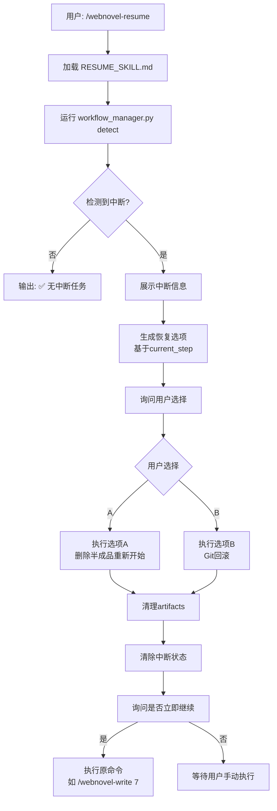

# 工作流恢复系统设计文档

> **创建日期**: 2026-01-01
> **需求来源**: 用户反馈 - "运行到write的step 2突然中断了，重新打开claude code应该怎么正确接续"
> **优先级**: 很重要 ⭐⭐⭐⭐⭐

---

## 📋 需求分析

### 用户需求

1. **优先级**: 很重要
2. **方案倾向**: Phase 2（完整）- workflow_state.json + 精确checkpoint追踪
3. **恢复策略**: 删除半成品，从头重新执行（不做智能续写）
4. **实现方式**: 需要专门的skill来指导，因为**不同step中断的接续难度不一样**

### 核心洞察

> "**在不同的step中断接续的难度其实是不一样的**" - 用户

**Step中断难度分级**：
- Step 1: ⭐ 简单（无副作用）
- Step 2: ⭐⭐ 中等（半成品文件）
- Step 3/6: ⭐⭐ 中等（幂等脚本）
- Step 4: ⭐⭐⭐ 复杂（state.json部分更新）
- Step 5: ⭐⭐⭐⭐ 高危（Git未提交）
- Step 7: ⭐⭐⭐⭐⭐ 极高（审查未完成，成本高）

---

## 🏗️ 系统架构

### 5个核心组件

```mermaid
flowchart TB
    User[用户] --> CMD[/webnovel-resume命令]
    CMD --> WM[workflow_manager.py<br/>状态检测+清理]
    CMD --> SKILL[RESUME_SKILL.md<br/>恢复策略知识库]

    WM --> STATE[workflow_state.json<br/>精确状态追踪]
    SKILL --> GUIDE[指导AI<br/>不同Step恢复策略]

    STATE --> DETECT[检测中断点]
    DETECT --> OPTIONS[生成恢复选项]

    OPTIONS --> USER_CHOICE{用户选择}
    USER_CHOICE -->|A| CLEANUP[清理半成品<br/>重新开始]
    USER_CHOICE -->|B| ROLLBACK[Git回滚<br/>回到稳定状态]

    CLEANUP --> RESUME[继续执行命令]
    ROLLBACK --> RESUME
```

### 组件职责

| 组件 | 文件路径 | 职责 | 状态 |
|------|---------|------|------|
| **1. workflow_state.json** | `.webnovel/workflow_state.json` | 精确记录每个Step状态 | ✅ 已设计 |
| **2. workflow_manager.py** | `.claude/skills/webnovel-writer/scripts/workflow_manager.py` | 状态追踪+中断检测+清理 | ✅ 已完成 |
| **3. RESUME_SKILL.md** | `.claude/skills/webnovel-writer/RESUME_SKILL.md` | 恢复策略知识库 | ✅ 已完成 |
| **4. /webnovel-resume** | `.claude/commands/webnovel-resume.md` | 恢复命令入口 | ⏳ 待创建 |
| **5. 命令集成** | 修改5个现有命令 | 集成workflow追踪 | ⏳ 待集成 |

---

## 📄 Component 1: workflow_state.json

### 文件路径
`.webnovel/workflow_state.json`

### 数据结构

```json
{
  "current_task": {
    "command": "webnovel-write",
    "args": {"chapter_num": 7},
    "started_at": "2026-01-01T14:30:00Z",
    "last_heartbeat": "2026-01-01T14:32:15Z",
    "status": "interrupted",
    "current_step": {
      "id": "Step 2",
      "name": "Generate Chapter Content",
      "status": "in_progress",
      "started_at": "2026-01-01T14:31:30Z",
      "progress_note": "已写1500字"
    },
    "completed_steps": [
      {
        "id": "Step 1",
        "name": "Load Context",
        "status": "completed",
        "started_at": "2026-01-01T14:30:05Z",
        "completed_at": "2026-01-01T14:31:25Z"
      }
    ],
    "artifacts": {
      "chapter_file": {
        "path": "正文/第0007章.md",
        "exists": true,
        "size_bytes": 1500,
        "status": "incomplete"
      },
      "git_status": {
        "uncommitted_changes": true
      }
    }
  },
  "last_stable_state": {
    "command": "webnovel-write",
    "chapter_num": 6,
    "git_tag": "ch0006",
    "completed_at": "2026-01-01T13:30:42Z"
  }
}
```

### 更新时机

- **任务开始**: `start-task`
- **Step开始**: `start-step`
- **Step完成**: `complete-step`
- **任务完成**: `complete-task`

---

## 🐍 Component 2: workflow_manager.py

### 文件路径
`.claude/skills/webnovel-writer/scripts/workflow_manager.py`

### 核心功能

```python
# 1. 任务管理
start_task(command, args)           # 开始新任务
complete_task(artifacts)            # 完成任务

# 2. Step管理
start_step(step_id, step_name)      # 开始Step
complete_step(step_id, artifacts)   # 完成Step

# 3. 中断检测
detect_interruption()               # 检测中断状态
analyze_recovery_options(info)      # 分析恢复选项

# 4. 清理工具
cleanup_artifacts(chapter_num)      # 清理半成品
clear_current_task()                # 清除中断任务
```

### CLI使用示例

```bash
# 开始任务
python workflow_manager.py start-task --command webnovel-write --chapter 7

# 开始Step
python workflow_manager.py start-step --step-id "Step 1" --step-name "Load Context"

# 完成Step
python workflow_manager.py complete-step --step-id "Step 1"

# 检测中断
python workflow_manager.py detect

# 清理半成品
python workflow_manager.py cleanup --chapter 7

# 清除中断状态
python workflow_manager.py clear
```

---

## 📚 Component 3: RESUME_SKILL.md

### 文件路径
`.claude/skills/webnovel-writer/RESUME_SKILL.md`

### 核心内容

1. **Step中断难度分级表**（7个Step）
2. **恢复流程标准协议**（3个Phase）
3. **不同Step的详细恢复策略**
4. **特殊场景处理**（多次中断、多个半成品等）
5. **FORBIDDEN清单**（禁止智能续写等）

### Skill加载方式

在 `/webnovel-resume` 命令中引用：

```markdown
**YOU MUST load the RESUME_SKILL.md knowledge base** before analyzing interruption.
```

---

## 🔧 Component 4: /webnovel-resume 命令

### 文件路径
`.claude/commands/webnovel-resume.md`

### 执行流程



### 命令框架（待创建）

```markdown
---
allowed-tools: Read, Bash
description: 恢复中断的网文创作任务，基于精确的workflow状态追踪
---

# /webnovel-resume

## Step 1: Load RESUME_SKILL.md

**YOU MUST read** `.claude/skills/webnovel-writer/RESUME_SKILL.md`

## Step 2: Detect Interruption

**Run**: `python workflow_manager.py detect`

## Step 3: Analyze & Present Options

基于 RESUME_SKILL.md 中的策略，展示恢复选项

## Step 4: Execute Recovery

根据用户选择，执行清理或回滚

## Step 5: Resume Task

询问用户是否立即继续执行原命令
```

---

## 🔄 Component 5: 命令集成

### 需要修改的5个命令

1. **webnovel-write.md**
2. **webnovel-review.md**
3. **webnovel-query.md**
4. **webnovel-plan.md**
5. **webnovel-init.md**

### 集成点（每个命令需添加）

#### 命令开始时（Step 0）

```markdown
## Step 0: Initialize Workflow Tracking (MANDATORY)

**BEFORE Step 1**, run:

\```bash
python .claude/skills/webnovel-writer/scripts/workflow_manager.py start-task \
  --command webnovel-write \
  --chapter {chapter_num}
\```

**Purpose**: 记录任务开始，启用中断恢复功能
```

#### 每个Step开始时

```markdown
**Before executing Step {N}**, run:

\```bash
python workflow_manager.py start-step \
  --step-id "Step {N}" \
  --step-name "{Step名称}"
\```
```

#### 每个Step完成时

```markdown
**After Step {N} completes**, run:

\```bash
python workflow_manager.py complete-step \
  --step-id "Step {N}" \
  --artifacts '{"key": "value"}'
\```
```

#### 命令结束时

```markdown
## Final Step: Complete Workflow Tracking (MANDATORY)

**After all steps complete**, run:

\```bash
python workflow_manager.py complete-task
\```

**Purpose**: 标记任务完成，更新 last_stable_state
```

### 集成示例（webnovel-write.md）

```markdown
## Execution Steps

### Step 0: Initialize Workflow Tracking
\```bash
python workflow_manager.py start-task --command webnovel-write --chapter {N}
\```

### Step 1: Load Context
\```bash
python workflow_manager.py start-step --step-id "Step 1" --step-name "Load Context"
\```

[原有Step 1内容]

\```bash
python workflow_manager.py complete-step --step-id "Step 1"
\```

### Step 2: Generate Chapter Content
\```bash
python workflow_manager.py start-step --step-id "Step 2" --step-name "Generate Chapter Content"
\```

[原有Step 2内容]

\```bash
python workflow_manager.py complete-step --step-id "Step 2" --artifacts '{"chapter_file": {"path": "正文/第{N:04d}章.md", "exists": true}}'
\```

[其他Step类似]

### Final: Complete Task
\```bash
python workflow_manager.py complete-task
\```
```

---

## 🎯 用户使用场景

### 场景1: Step 2中断（最常见）

```
【会话1 - 中断前】
用户: /webnovel-write 7
AI: [执行Step 1完成]
AI: [执行Step 2，写了1500字]
[突然中断：崩溃/超时/网络断开]

【会话2 - 恢复】
用户: /webnovel-resume

AI: 🔍 正在检测中断状态...

    🔴 检测到中断任务：

    任务：/webnovel-write 7
    中断时间：2026-01-01 14:32:15（5分钟前）
    中断位置：Step 2 - 章节内容生成中

    已完成：
      ✅ Step 1: 上下文加载

    未完成：
      ⏸️ Step 2: 章节内容（已写1500字/目标3000-5000字）
      ⏹️ Step 3-7: 未开始

    恢复选项：
    A) 删除半成品，从Step 1重新开始（推荐）⭐
    B) 回滚到Ch6，放弃Ch7所有进度

    请选择（A/B）：

用户: A

AI: ✅ 执行选项A：删除半成品，重新开始

    ✅ 已清理: 正文/第0007章.md, Git暂存区已清理
    ✅ 中断任务已清除

    现在可以执行 /webnovel-write 7

    是否立即开始？（Y/N）

用户: Y

AI: [正常执行完整流程]
```

---

### 场景2: Step 7中断（成本极高）

```
用户: /webnovel-resume

AI: 🔴 检测到中断任务：

    中断位置：Step 7 - 双章审查

    已完成：
      ✅ Step 1-6: 全部完成
      ✅ 章节文件已保存
      ✅ Git已提交（tag ch0007）

    未完成：
      ⏸️ Step 7: 双章审查（可能部分审查员未完成）

    恢复选项：
    A) 重新执行双章审查（成本：~$0.15，耗时5-10分钟）⚠️
    B) 跳过审查，继续下一章（可后续补审）

    💡 建议：如非关键章节，选择B节省成本

    请选择（A/B）：

用户: B

AI: ✅ 已跳过审查

    💡 可后续用 /webnovel-review 5-6 补审

    现在可以继续创作Ch8
```

---

## 📊 实施计划

### Phase 1: 核心组件（已完成）

- [x] 设计 workflow_state.json 结构
- [x] 创建 workflow_manager.py（445行）
- [x] 创建 RESUME_SKILL.md（600+行）

### Phase 2: 命令创建（待完成）

- [ ] 创建 /webnovel-resume.md 命令
- [ ] 测试中断检测功能
- [ ] 测试恢复流程

### Phase 3: 集成现有命令（待完成）

- [ ] 修改 webnovel-write.md（添加Step 0 + 每个Step追踪）
- [ ] 修改 webnovel-review.md
- [ ] 修改 webnovel-query.md（可选）
- [ ] 修改 webnovel-plan.md（可选）
- [ ] 修改 webnovel-init.md（可选）

### Phase 4: 测试验证（待完成）

- [ ] 模拟Step 2中断 → 恢复
- [ ] 模拟Step 4中断 → 恢复
- [ ] 模拟Step 7中断 → 恢复
- [ ] 验证多次中断场景

---

## 🔧 技术要点

### 1. 幂等性设计

**哪些操作是幂等的**：
- ✅ Step 3: extract_entities.py（可重复运行）
- ✅ Step 6: update_state.py --strand-dominant（可重复运行）

**哪些操作不是幂等的**：
- ❌ Step 2: 章节生成（半成品文件）
- ❌ Step 4: state.json更新（部分更新风险）
- ❌ Step 5: Git commit（重复commit）

### 2. Git作为可靠回滚点

**每章完成后的稳定状态**：
```
Git tag: ch0006
  ├─ 正文/第0006章.md
  ├─ .webnovel/state.json（current_chapter: 6）
  ├─ 设定集/角色设定.md（完整）
  └─ Git commit: f975aa2
```

**回滚命令**：
```bash
git reset --hard ch0006
```

### 3. 状态一致性检查

**Step 4中断的危险性**：

```python
# 可能的不一致状态
{
  "progress": {
    "current_chapter": 7,  # 已更新
    "total_words": 25000   # 已更新
  },
  "protagonist_state": {
    "power": {
      "realm": "练气期",   # 未更新（应该是凝气期）
      "layer": 6            # 未更新（应该是1）
    }
  }
}
```

**检测方法**：
```python
# 读取章节文件，提取实力描述
# 对比state.json中的实力
# 如不一致 → 标记为"需修复"
```

---

## 📝 文档输出

### 核心文档

1. **工作流恢复系统设计文档**（本文档）
2. **用户使用指南**（待创建）
3. **开发者集成指南**（待创建）

### 用户使用指南（简化版）

```markdown
# 如何恢复中断的创作任务

## 问题
Claude Code突然中断了，重新打开后怎么继续？

## 解决方案
执行命令：`/webnovel-resume`

## 它会做什么
1. 检测中断位置（哪个Step）
2. 分析中断影响（文件/Git/state.json）
3. 提供恢复选项（通常2-3个）
4. 根据你的选择，清理半成品或回滚
5. 询问是否立即继续

## 常见场景

### 场景1: 写了一半就中断
选择：删除半成品，重新写（推荐）
原因：质量保证，防止前后矛盾

### 场景2: 已经Git提交但没审查
选择：跳过审查，继续下一章
原因：审查成本高，可后续补审

### 场景3: state.json可能有问题
选择：回滚到上一章（安全）
原因：修复复杂状态不如重新开始
```

---

**Phase 1核心组件已完成，Phase 2/3待实施。**
