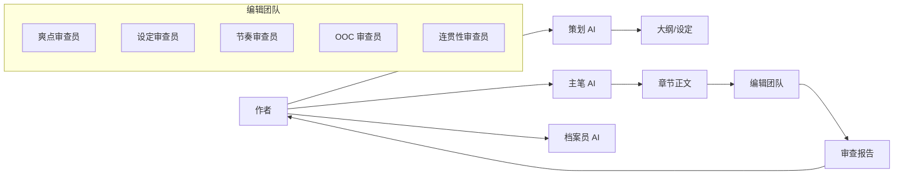

# Webnovel Writer 方案对比与融合建议

> **对比日期**: 2025-12-29
> **对比对象**: Claude 设计文档 vs Gemini 增强方案

---

## 1. 核心理念对比

### Claude 方案（我的设计）
**定位**: **工程化的工具系统**
- 强调完整的功能模块和数据流
- 注重技术实现细节和可扩展性
- 偏向"工具箱"思维

### Gemini 方案
**定位**: **AI 辅助网文工作室**
- 强调角色分工（主笔/策划/编辑/档案员）
- 注重创作流程和质量把控
- 偏向"团队协作"思维

**评价**:
- ✅ Gemini 的"工作室"概念更符合网文创作的实际场景
- ✅ 角色分工让 AI 的职责更清晰
- 建议：**采用 Gemini 的理念框架，用 Claude 方案的技术细节填充**

---

## 2. 架构设计对比

### 目录结构

| 特性 | Claude 方案 | Gemini 方案 | 评价 |
|------|-----------|------------|------|
| **基础结构** | commands/ + skills/ | 同左 | 一致 ✅ |
| **agents/** | ❌ 无 | ✅ 三个审查员 | **Gemini 胜出** |
| **references/** | ✅ 详细手册 | ✅ 防幻觉协议 | **Claude 更详细** |
| **templates/** | ✅ 5 种题材 | ✅ 结构模板 | **Claude 更全面** |
| **scripts/** | ✅ 4 个脚本 | ✅ 状态管理器 | Claude 更完整 |

**融合建议**:
```
.claude/skills/webnovel-writer/
├── SKILL.md                     # 主笔 AI (融合两者)
├── agents/                      # ✨ Gemini 提出
│   ├── high-point-checker.md   # 爽点审查员
│   ├── consistency-checker.md  # 设定审查员
│   └── pacing-checker.md       # 节奏审查员
├── references/                  # Claude 更详细
│   ├── anti-hallucination.md   # ✨ Gemini 的三大定律
│   ├── cool-points-guide.md    # 爽点设计指南
│   ├── genre-tropes.md         # 题材套路库
│   └── pacing-control.md       # 节奏控制指南
├── templates/                   # Claude 更全面
│   ├── genres/                 # 5 种题材模板
│   └── structures/             # 卷/篇/章模板
└── scripts/                     # Claude 更完整
    ├── init_project.py
    ├── state_manager.py        # ✨ Gemini 的动态状态
    ├── consistency_check.py
    └── export_novel.py
```

---

## 3. 核心功能对比

### 3.1 爽点引擎

| 方面 | Claude 方案 | Gemini 方案 |
|------|-----------|------------|
| **设计** | 爽点类型库 + 密度要求 | 强制 Think 步骤规划爽点 |
| **检查** | 审查引擎检查爽点密度 | high-point-checker 评分"爽感指数" |
| **强度** | 被动检查 | 主动强制（无爽点需说明理由） |

**评价**:
- ✅ **Gemini 的"强制 Think"机制更严格**
- ✅ **Claude 的爽点类型库更系统**
- **融合**: Think 步骤 + 类型库 + 审查员三重保障

### 3.2 防幻觉机制

| 方面 | Claude 方案 | Gemini 方案 |
|------|-----------|------------|
| **理论** | 反幻觉协议（检查清单） | **三大定律**（更易记） |
| **实现** | 5 项检查（角色/实力/地点/物品/时间线） | [NEW_ENTITY] 标签 + 自动抓取 |
| **流程** | 生成后验证 | 发明时申报 |

**Gemini 三大定律**:
1. **大纲即法律**: 不得擅自偏离大纲
2. **设定即物理**: 战力/招式必须符合设定
3. **发明需申报**: 新角色/地点/物品必须标记 [NEW_ENTITY]

**评价**:
- ✅ **Gemini 的"三大定律"更简洁有力**
- ✅ **[NEW_ENTITY] 标签机制很实用**
- ✅ **Claude 的 5 项检查清单更详细**
- **融合**: 三大定律 + 详细检查清单 + [NEW_ENTITY] 标签

### 3.3 状态管理

| 特性 | Claude 方案 | Gemini 方案 |
|------|-----------|------------|
| **主角状态** | 基础信息（境界/金手指） | **动态状态**（修为层数/当前地图） |
| **人际关系** | 关系网络 | **好感度/仇恨度**（数值化） |
| **伏笔管理** | 简单记录 | **待回收/已回收**（状态标记） |

**评价**:
- ✅ **Gemini 的动态状态更适合网文连载**
- ✅ **好感度系统很实用**
- **融合**: state.json 扩展为动态状态

### 3.4 交互式创作

| 特性 | Claude 方案 | Gemini 方案 |
|------|-----------|------------|
| **分支选择** | ❌ 未提及 | ✅ AskUserQuestion 实现剧情分支 |
| **设定补全** | 查询引擎 | ✅ 缺少设定时主动提问 |

**评价**:
- ✅ **Gemini 的交互式创作流是重大创新**
- **融合**: 在 SKILL.md 中增加交互式决策机制

---

## 4. 审查体系对比

### Claude 方案: 审查引擎（Reviewer）

**触发**: 每 10 章自动 + 手动触发
**维度**: 5 个检查项
- 设定一致性
- 人物 OOC
- 情节连贯性
- 节奏问题
- 爽点密度

### Gemini 方案: 三个专职审查员（Agents）

**角色**:
1. **high-point-checker**: 爽感指数评分
2. **consistency-checker**: 战力/人设审查
3. **pacing-checker**: 节奏审查（防灌水）

**评价**:
- ✅ **Gemini 的 agents 机制更清晰**（类似 Crucible 的 bi-chapter review）
- ✅ **Claude 的检查维度更全面**
- **融合**: 用 agents 实现 5 个检查维度

---

## 5. 融合后的完整架构

### 5.1 角色分工（采用 Gemini 理念）



### 5.2 防幻觉三大定律 + 实施细则

**定律 1: 大纲即法律**
- 实施: 每章生成前，读取大纲并在 Think 步骤中确认符合度
- 违规标记: [OUTLINE_DEVIATION] + 说明理由

**定律 2: 设定即物理**
- 实施: 从 state.json 读取主角/配角实力，生成前验证
- 违规标记: [POWER_CONFLICT] + 冲突详情

**定律 3: 发明需申报**
- 实施: 所有新实体必须标记 [NEW_ENTITY: 类型, 名称, 描述]
- 后处理: Python 脚本自动提取，询问用户是否加入设定集

### 5.3 动态状态管理（state.json 升级版）

```json
{
  "protagonist_state": {
    "name": "林天",
    "power": {
      "realm": "筑基期",
      "layer": 7,
      "bottleneck": "第 9 层（需要天雷果突破）"
    },
    "location": {
      "current": "天云宗外门",
      "last_chapter": 45
    },
    "golden_finger": {
      "name": "吞噬系统",
      "level": 2,
      "cooldown": "剩余 3 天"
    }
  },

  "relationships": {
    "李雪": {
      "type": "青梅竹马",
      "affection": 85,
      "status": "暧昧期"
    },
    "血煞门": {
      "type": "仇敌势力",
      "hatred": 100,
      "status": "不死不休"
    }
  },

  "plot_threads": {
    "active": [
      {
        "id": 1,
        "description": "寻找父亲失踪真相",
        "planted_at": 5,
        "status": "进行中",
        "expected_resolution": "第一卷末"
      }
    ],
    "foreshadowing": [
      {
        "id": 1,
        "content": "林家宝库神秘铭文",
        "planted_at": 12,
        "status": "待回收",
        "hints": ["铭文似乎与系统有关"]
      }
    ]
  }
}
```

### 5.4 交互式创作流（Gemini 创新）

**场景 1: 剧情分支**
```
AI: 检测到剧情分支点（第 50 章）

当前情节: 血煞门少主挑衅主角，并侮辱已故的父母。

请选择主角反应：
A. 杀伐果断，当场斩杀（冲动路线，会引发血煞门全面报复）
B. 隐忍暂避，记下此仇（理智路线，为后续复仇埋伏笔）
C. 让我自定义...

用户选择: B

AI: 理解，主角将隐忍暂避。我会在内心独白中强化"君子报仇十年不晚"的动机。
```

**场景 2: 设定补全**
```
AI: 检测到缺失设定（第 60 章）

剧情需要: 主角进入"黑风山脉秘境"

问题: 设定集中未记录此秘境的详细信息。

请补充以下设定：
1. 秘境内有哪些危险/机遇？
   [ ] 妖兽（请指定种类和实力）
   [ ] 阵法陷阱
   [ ] 天材地宝（请指定）
   [ ] 其他修士竞争

2. 秘境开启频率？
   [ ] 千年一次（稀有）
   [ ] 百年一次（罕见）
   [ ] 随时可进（常规）

用户回答后，AI 自动更新设定集并继续生成。
```

---

## 6. 融合方案优势

| 优势点 | 来源 | 说明 |
|-------|------|------|
| **清晰的角色分工** | Gemini | 工作室概念，易于理解 |
| **严格的防幻觉机制** | Gemini + Claude | 三大定律 + 5 项检查 + [NEW_ENTITY] |
| **动态状态管理** | Gemini + Claude | 好感度/层数/伏笔状态 |
| **agents 审查体系** | Gemini | 5 个专职审查员 |
| **交互式创作流** | Gemini | 分支选择 + 设定补全 |
| **完整的技术实现** | Claude | Python 脚本 + 数据结构 |
| **详细的参考手册** | Claude | 爽点指南 + 题材套路库 |
| **5 种题材模板** | Claude | 修仙/都市/玄幻/游戏/科幻 |

---

## 7. 实施建议

### 第一阶段：核心框架（借鉴 Gemini 架构）
1. ✅ 创建目录结构（增加 agents/）
2. ✅ 实现 state_manager.py（动态状态）
3. ✅ 编写 SKILL.md（主笔 AI，融合三大定律）

### 第二阶段：审查体系（Gemini agents + Claude 检查项）
4. ✅ 实现 5 个 agents（high-point/consistency/pacing/ooc/continuity）
5. ✅ 编写 anti-hallucination.md（三大定律详细说明）

### 第三阶段：业务功能（Claude 完整实现）
6. ✅ 实现 commands（init/plan/write/review/query）
7. ✅ 编写参考手册（爽点指南/题材套路库）
8. ✅ 创建题材模板（修仙作为 Demo）

### 第四阶段：交互增强（Gemini 创新）
9. ✅ 在 write 命令中增加分支选择
10. ✅ 在 planner 中增加设定补全询问

---

## 8. 最终决策

### 推荐方案：**Gemini 架构 + Claude 细节**

**理由**:
1. Gemini 的"工作室"概念更符合网文创作场景
2. agents 机制比单一审查引擎更清晰
3. 三大定律比检查清单更易记
4. 交互式创作流是重大创新
5. Claude 方案提供了完整的技术实现细节

**实施路径**:
- 采用 Gemini 的理念框架和目录结构
- 用 Claude 方案的详细设计填充每个模块
- 优先实现 Gemini 提出的创新点（agents/三大定律/交互式）

---

## 9. 待确认问题

请您确认：

1. **是否同意融合方案？**
   - [ ] 同意，按融合方案实施
   - [ ] 更偏好 Gemini 方案
   - [ ] 更偏好 Claude 方案
   - [ ] 有其他建议

2. **实施优先级？**
   - [ ] 先实现核心功能（init/plan/write）
   - [ ] 先实现审查体系（agents）
   - [ ] 先实现交互式创作流
   - [ ] 一次性实现全部功能

3. **题材选择（第一个模板）？**
   - [ ] 修仙（系统流/重生流）
   - [ ] 都市（异能/重生）
   - [ ] 玄幻（穿越/异世）
   - [ ] 其他

---

**文档状态**: 待用户确认
**下一步**: 根据确认结果开始实施
