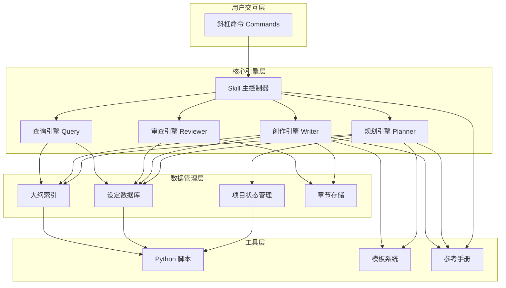
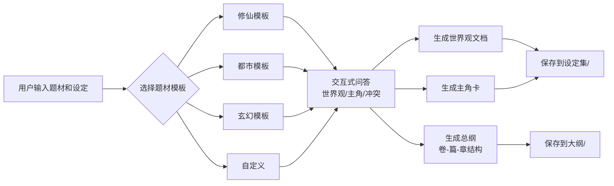
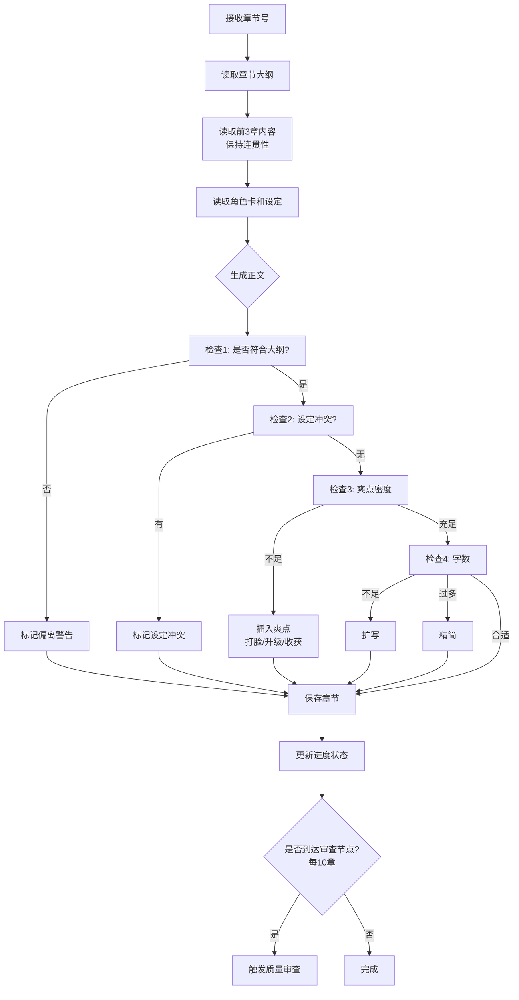

# 网文创作 Skill 设计文档

> **项目名称**: webnovel-writer
> **版本**: v1.0.0-design
> **创建日期**: 2025-12-29
> **目标**: 为 Claude Code 创建一个支持百万字级别网文创作的专业 Skill 系统

---

## 📋 目录

1. [需求分析](#1-需求分析)
2. [系统架构](#2-系统架构)
3. [功能模块设计](#3-功能模块设计)
4. [数据结构设计](#4-数据结构设计)
5. [工作流程](#5-工作流程)
6. [技术实现方案](#6-技术实现方案)
7. [扩展性与迭代计划](#7-扩展性与迭代计划)
8. [风险与挑战](#8-风险与挑战)

---

## 1. 需求分析

### 1.1 核心问题

**传统小说创作工具（如 Crucible）无法满足网文创作的特殊需求：**

| 问题维度 | 具体表现 | 影响 |
|---------|---------|------|
| **篇幅规模** | 网文通常 100-500 万字，Crucible 仅支持 12-25 万词 | 无法处理超长篇幅 |
| **章节数量** | 网文 500-2000+ 章，Crucible 仅 30-50 章 | 结构框架不适用 |
| **更新模式** | 网文持续连载，Crucible 一次性完成 | 缺少进度管理和状态保存 |
| **叙事节奏** | 网文快节奏爽点密集，Crucible 注重深度铺垫 | 节奏控制逻辑不匹配 |
| **设定管理** | 网文需要庞大的世界观和角色系统 | 缺少设定查询和一致性检查 |
| **创作周期** | 网文可能写作 1-3 年 | 缺少长期维护和版本管理 |

### 1.2 目标用户

- **网文作者**：希望用 AI 提高创作效率，保持设定一致性
- **新手作者**：需要模板和指导来规划长篇小说
- **业余创作者**：时间有限，需要工具辅助保持连贯性

### 1.3 核心需求

#### 必须满足（P0）
- ✅ 支持 100-500 万字篇幅
- ✅ 三层大纲结构（卷-篇-章）
- ✅ 章节级创作（3000-5000 字/章）
- ✅ 设定管理和查询
- ✅ 连贯性检查（避免前后矛盾）
- ✅ 进度追踪和断点续写

#### 应该满足（P1）
- ⭕ 爽点引擎（自动插入冲突、打脸、升级等）
- ⭕ 角色卡管理（自动生成和维护角色信息）
- ⭕ 质量审查（每 10-20 章触发）
- ⭕ 多题材模板（修仙、都市、玄幻、游戏、科幻）

#### 可以满足（P2）
- 🔘 AI 自动补全设定（根据已有内容推断）
- 🔘 伏笔管理（埋伏笔、提醒回收）
- 🔘 多版本管理（支持改写和分支）
- 🔘 导出功能（适配起点、晋江等平台格式）

---

## 2. 系统架构

### 2.1 整体架构图



### 2.2 目录结构

```
novel-skill/                          # 项目根目录
│
├── .claude/
│   ├── commands/                     # 斜杠命令
│   │   ├── webnovel-init.md         # 初始化项目
│   │   ├── webnovel-plan.md         # 规划大纲
│   │   ├── webnovel-write.md        # 创作章节
│   │   ├── webnovel-review.md       # 质量审查
│   │   ├── webnovel-query.md        # 查询设定
│   │   └── webnovel-status.md       # 查看状态
│   │
│   └── skills/
│       └── webnovel-writer/
│           ├── SKILL.md             # Skill 主配置文件
│           │
│           ├── references/          # 参考手册
│           │   ├── 网文创作理论.md
│           │   ├── 爽点设计手册.md
│           │   ├── 节奏控制指南.md
│           │   ├── 力量体系模板.md
│           │   ├── 常见题材套路库.md
│           │   └── 角色塑造技巧.md
│           │
│           ├── templates/           # 模板库
│           │   ├── genres/          # 题材模板
│           │   │   ├── 修仙.md
│           │   │   ├── 都市.md
│           │   │   ├── 玄幻.md
│           │   │   ├── 游戏.md
│           │   │   └── 科幻.md
│           │   │
│           │   ├── 世界观模板.md
│           │   ├── 角色卡模板.md
│           │   ├── 卷大纲模板.md
│           │   ├── 篇大纲模板.md
│           │   ├── 章节大纲模板.md
│           │   └── 正文章节模板.md
│           │
│           └── scripts/             # 自动化脚本
│               ├── init_project.py
│               ├── track_progress.py
│               ├── check_consistency.py
│               └── export_novel.py
│
└── 用户项目目录/                     # 创建后的项目结构
    ├── .webnovel/
    │   ├── state.json              # 项目状态
    │   └── backups/                # 自动备份
    │
    ├── 设定集/
    │   ├── 世界观.md
    │   ├── 力量体系.md
    │   ├── 势力分布.md
    │   ├── 主角卡.md
    │   └── 角色库/
    │       ├── 主要角色/
    │       ├── 次要角色/
    │       └── 反派角色/
    │
    ├── 大纲/
    │   ├── 总纲.md                 # 全书大纲
    │   ├── 第1卷-详细大纲.md
    │   ├── 第2卷-详细大纲.md
    │   └── ...
    │
    ├── 正文/
    │   ├── 第0001章.md
    │   ├── 第0002章.md
    │   └── ...
    │
    └── 审查报告/
        ├── 第001-010章审查报告.md
        ├── 第011-020章审查报告.md
        └── ...
```

### 2.3 技术栈

| 层级 | 技术选型 | 说明 |
|------|---------|------|
| **用户界面** | Slash Commands (Markdown) | Claude Code 原生命令系统 |
| **核心逻辑** | Skill (Markdown + Prompts) | AI 引导式创作流程 |
| **数据存储** | Markdown + JSON | 文本易编辑，JSON 便于程序处理 |
| **自动化** | Python 3.8+ | 项目初始化、进度追踪、一致性检查 |
| **版本控制** | Git (可选) | 支持多版本和回滚 |

---

## 3. 功能模块设计

### 3.1 规划引擎（Planner）

#### 3.1.1 功能概述

**输入**：题材类型、基础设定、主角构想
**输出**：完整的世界观、角色卡、三层大纲

#### 3.1.2 工作流程



#### 3.1.3 题材模板设计

**修仙模板示例：**

```yaml
题材: 修仙
核心冲突: 资质/资源争夺
力量体系:
  - 练气期（1-9层）
  - 筑基期
  - 金丹期
  - 元婴期
  - 化神期
  - ...
典型金手指:
  - 系统
  - 重生
  - 老爷爷
  - 特殊体质
常见爽点:
  - 打脸装逼
  - 越级挑战
  - 收美女
  - 得宝物
大纲结构建议:
  - 第1卷: 新手村（家族/宗门入门）100-150章
  - 第2卷: 小世界历练 150-200章
  - 第3卷: 大世界争锋 200-300章
  - ...
```

#### 3.1.4 大纲生成策略

**三层结构映射：**

```
总篇幅: 200万字
├── 卷级别: 8-12卷（每卷 15-30万字）
│   └── 主题: 新手村、外界、秘境、大战等
│
├── 篇级别: 每卷 2-4篇（每篇 5-10万字）
│   └── 阶段: 铺垫、冲突、高潮、收尾
│
└── 章级别: 每篇 15-30章（每章 3000-5000字）
    └── 节奏: 引入、发展、转折、爽点
```

### 3.2 创作引擎（Writer）

#### 3.2.1 功能概述

**输入**：章节号、对应的章节大纲
**输出**：3000-5000 字的正文内容

#### 3.2.2 创作流程



#### 3.2.3 爽点引擎设计

**爽点类型库：**

```yaml
爽点类型:

  打脸类:
    - 被看不起 → 实力展示 → 对方震惊/后悔
    - 被挑衅 → 一招秒杀 → 全场哗然
    - 被质疑 → 拿出证据 → 对方无地自容

  升级类:
    - 突破瓶颈（实力提升）
    - 领悟技能（新招式）
    - 获得机缘（宝物、传承）

  收获类:
    - 美女投怀送抱
    - 敌人求饶献宝
    - 势力主动拉拢

  冲突升级:
    - 小喽啰 → 小BOSS → 大BOSS登场
    - 家族矛盾 → 宗门矛盾 → 天下大势

密度要求:
  - 每章至少1个爽点
  - 每5章至少1个大爽点（打脸+升级+收获组合）
  - 每10章至少1次实力提升
```

#### 3.2.4 反幻觉机制

**防止 AI 编造设定的检查清单：**

1. **角色出场检查**：新角色必须先在角色库登记
2. **实力检查**：主角和配角的实力必须符合设定
3. **地点检查**：出现的地点必须在世界观中存在
4. **物品检查**：宝物、功法必须符合力量体系
5. **时间线检查**：事件发生时间不能冲突

**实现方式：**
- 生成内容后，自动提取关键信息（人物、地点、物品）
- 与设定集交叉验证
- 发现冲突立即提示并修正

### 3.3 审查引擎（Reviewer）

#### 3.3.1 触发时机

- **自动触发**：每写完 10 章
- **手动触发**：`/webnovel-review [起始章-结束章]`

#### 3.3.2 审查维度

| 维度 | 检查内容 | 严重程度 |
|------|---------|---------|
| **设定一致性** | 人物实力、地点、物品是否与设定集冲突 | 🔴 高 |
| **人物 OOC** | 角色行为是否符合性格设定 | 🟠 中 |
| **情节连贯性** | 前后章节逻辑是否通顺 | 🟠 中 |
| **节奏问题** | 是否拖沓或过快 | 🟡 低 |
| **爽点密度** | 是否符合每章1个爽点的标准 | 🟡 低 |

#### 3.3.3 报告格式

```markdown
# 第 1-10 章质量审查报告

## ✅ 通过项
- 设定一致性：无冲突
- 爽点密度：平均每章 1.2 个爽点

## ⚠️ 警告项
- 第 5 章：主角性格略显矛盾
  - 问题：第 5 章表现懦弱，与第 3 章果断形象不符
  - 建议：增加心理描写解释变化原因

## 🔴 严重问题
- 第 8 章：设定冲突
  - 问题：主角使用"火云掌"，但设定集中主角修炼的是"寒冰诀"
  - 建议：修改为"寒冰掌"或在设定集中补充说明

## 📊 统计数据
- 总字数：42,356 字
- 平均章节字数：4,236 字
- 新增角色：5 人
- 主角实力变化：练气 3 层 → 练气 7 层
```

### 3.4 查询引擎（Query）

#### 3.4.1 功能

快速查找设定信息，避免创作时翻找文档。

#### 3.4.2 查询类型

```bash
# 角色查询
/webnovel-query 主角
/webnovel-query 林天

# 实力查询
/webnovel-query 当前主角实力
/webnovel-query 练气期

# 势力查询
/webnovel-query 林家
/webnovel-query 天云宗

# 物品查询
/webnovel-query 玄冰剑
/webnovel-query 宝物列表

# 伏笔查询
/webnovel-query 未回收伏笔
```

#### 3.4.3 实现方式

- **全文搜索**：在设定集和大纲中搜索关键词
- **结构化查询**：从 `state.json` 中读取结构化数据
- **智能推荐**：AI 理解查询意图，返回相关信息

---

## 4. 数据结构设计

### 4.1 项目状态文件（state.json）

```json
{
  "project_info": {
    "title": "废柴崛起之路",
    "genre": "修仙",
    "author": "作者名",
    "created_at": "2025-12-29",
    "target_words": 2000000,
    "target_chapters": 600
  },

  "progress": {
    "current_chapter": 45,
    "total_words": 198765,
    "last_updated": "2025-12-29 22:00:00",
    "volumes_completed": [1, 2],
    "current_volume": 3
  },

  "outline_structure": {
    "volumes": [
      {
        "volume_id": 1,
        "title": "新手村篇",
        "chapters": "1-100",
        "status": "completed",
        "parts": [
          {
            "part_id": 1,
            "title": "觉醒",
            "chapters": "1-30"
          },
          {
            "part_id": 2,
            "title": "崛起",
            "chapters": "31-70"
          },
          {
            "part_id": 3,
            "title": "离开",
            "chapters": "71-100"
          }
        ]
      }
    ]
  },

  "characters": {
    "protagonist": {
      "name": "林天",
      "age": 18,
      "power_level": "练气七层",
      "personality": "隐忍、果断、重情义",
      "golden_finger": "吞噬系统",
      "first_appearance": 1
    },
    "supporting_cast": [
      {
        "name": "李雪",
        "role": "青梅竹马",
        "power_level": "练气五层",
        "relationship": "暧昧",
        "first_appearance": 3,
        "last_appearance": 45
      }
    ],
    "antagonists": []
  },

  "world_settings": {
    "power_system": "练气-筑基-金丹-元婴-化神",
    "factions": ["林家", "天云宗", "血煞门"],
    "locations": ["青云镇", "天云城", "黑风山脉"]
  },

  "review_checkpoints": [
    {
      "chapters": "1-10",
      "date": "2025-12-20",
      "status": "passed",
      "issues": 2
    }
  ],

  "plot_threads": {
    "active_threads": [
      {
        "id": 1,
        "description": "寻找父亲失踪真相",
        "introduced_at": 5,
        "expected_resolution": "第一卷末"
      }
    ],
    "foreshadowing": [
      {
        "id": 1,
        "content": "林家宝库神秘铭文",
        "planted_at": 12,
        "resolved": false
      }
    ]
  }
}
```

### 4.2 角色卡模板

```markdown
# 角色卡：林天

## 基础信息
- **姓名**: 林天
- **性别**: 男
- **年龄**: 18岁 → 25岁（当前）
- **身份**: 林家废柴少爷 → 天云宗真传弟子

## 实力信息
- **当前境界**: 筑基期圆满
- **修炼功法**: 《吞噬诀》
- **主要技能**:
  - 吞噬之力（金手指）
  - 天雷掌（攻击）
  - 幻影步（身法）

## 性格特点
- **核心性格**: 隐忍、果断、重情义
- **成长变化**:
  - 初期：懦弱自卑
  - 中期：冷静腹黑
  - 后期：霸气护短

## 关系网
- **家族**: 林家（已灭）
- **师门**: 天云宗
- **红颜**: 李雪（青梅竹马）、云仙子（道侣）
- **兄弟**: 王虎
- **仇敌**: 血煞门少主

## 重要剧情节点
- 第 1 章：系统觉醒
- 第 50 章：突破筑基
- 第 100 章：林家被灭，父母死亡（动机强化）
- 第 200 章：加入天云宗

## 金手指详情
- **名称**: 吞噬系统
- **能力**: 吞噬他人修为、技能、血脉
- **限制**: 每次吞噬需要冷却 7 天
- **成长**: 随境界提升，吞噬效率增加
```

### 4.3 章节大纲模板

```markdown
# 第 45 章大纲：宗门大比

## 本章目标
- 主角参加宗门大比
- 打脸嘲讽者
- 展示吞噬能力（初次公开）

## 剧情梗概
1. 大比开始，主角抽签对战仇人（王少）
2. 王少嘲讽主角是"林家废物"
3. 主角隐藏实力，佯装落败
4. 王少得意忘形，主角突然反击
5. 一招制敌，展示吞噬能力，全场震惊
6. 长老关注，获得秘境入场券（下章伏笔）

## 爽点设计
- **打脸**: 王少嘲讽 → 被秒杀 → 全场哗然
- **装逼**: 隐藏实力 → 突然爆发 → 惊艳全场
- **收获**: 获得秘境入场券

## 需要出场角色
- 林天（主角）
- 王少（对手）
- 云长老（裁判）
- 李雪（观众席）

## 环境设定
- 地点：天云宗演武场
- 时间：清晨
- 天气：晴朗

## 关键台词
- 王少："林家废物也配参加大比？"
- 主角："谁是废物，试试便知。"

## 字数要求
3500-4000 字

## 注意事项
- 不要过早暴露吞噬系统的完整能力
- 王少败北后记仇，为后续冲突埋伏笔
```

---

## 5. 工作流程

### 5.1 完整创作流程

```mermaid
flowchart TD
    A[开始] --> B[/webnovel-init]
    B --> C{选择题材模板}
    C --> D[交互式问答<br/>世界观/主角/冲突]
    D --> E[生成设定集和总纲]

    E --> F[/webnovel-plan 1<br/>规划第1卷详细大纲]
    F --> G{大纲是否满意?}
    G -->|否| H[手动修改大纲]
    G -->|是| I[开始创作]
    H --> I

    I --> J[/webnovel-write 1<br/>创作第1章]
    J --> K[/webnovel-write 2<br/>创作第2章]
    K --> L[...]

    L --> M{是否到达第10章?}
    M -->|否| N[继续创作]
    M -->|是| O[自动触发审查]

    O --> P{审查是否通过?}
    P -->|有问题| Q[根据报告修改]
    P -->|通过| R[继续创作]

    Q --> R
    N --> M

    R --> S{第一卷是否完成?}
    S -->|否| J
    S -->|是| T[/webnovel-plan 2<br/>规划第2卷]

    T --> U{全书是否完成?}
    U -->|否| I
    U -->|是| V[完成]
```

### 5.2 日常创作流程

```mermaid
flowchart LR
    A[启动会话] --> B[/webnovel-status<br/>查看进度]
    B --> C{查看当前章节大纲}
    C --> D[/webnovel-query<br/>查询相关设定]
    D --> E[/webnovel-write N<br/>创作章节]
    E --> F{字数和质量检查}
    F -->|不满意| G[手动修改]
    F -->|满意| H[保存章节]
    G --> H
    H --> I{是否到审查节点?}
    I -->|是| J[/webnovel-review]
    I -->|否| K[结束会话]
    J --> K
```

---

## 6. 技术实现方案

### 6.1 命令实现（Commands）

#### `/webnovel-init`

```markdown
---
allowed-tools: Read, Write, Glob, Bash, AskUserQuestion
argument-hint: [genre] | 留空交互式选择
description: 初始化网文项目，生成设定集和大纲框架
---

# /webnovel-init

初始化网文创作项目。

## 执行流程

1. **检测现有项目**
   - 如果当前目录已有项目，询问是否覆盖

2. **选择题材**
   - 使用 AskUserQuestion 让用户选择题材
   - 选项：修仙、都市、玄幻、游戏、科幻、自定义

3. **调用 webnovel-writer skill**
   - 传递题材类型给 skill
   - Skill 引导交互式问答

4. **生成项目结构**
   - 运行 `python scripts/init_project.py`
   - 创建目录结构
   - 生成初始文件

5. **输出提示**
   - 显示项目路径
   - 提示下一步操作：`/webnovel-plan 1`
```

#### `/webnovel-write [章节号]`

```markdown
---
allowed-tools: Read, Write, Edit, Grep, Bash
argument-hint: [chapter number]
description: 创作指定章节的正文内容
---

# /webnovel-write

按大纲创作章节内容。

## 执行流程

1. **读取章节大纲**
   - 从 `大纲/` 目录找到对应章节大纲

2. **读取上下文**
   - 读取前 3 章内容（保持连贯性）
   - 读取相关角色卡
   - 读取世界观设定

3. **调用 webnovel-writer skill**
   - 传递大纲、上下文、设定
   - Skill 生成正文

4. **质量检查**
   - 检查是否符合大纲
   - 检查设定冲突
   - 检查爽点密度
   - 检查字数（3000-5000）

5. **保存章节**
   - 写入 `正文/第XXXX章.md`
   - 更新 `state.json` 进度

6. **检查审查节点**
   - 如果是第 10/20/30... 章，自动触发审查
```

### 6.2 Skill 实现（Skills）

#### SKILL.md 核心结构

```markdown
---
name: webnovel-writer
description: 网文创作专用 AI 助手，支持百万字级别长篇小说的规划、创作和管理
---

# 网文创作 Skill

## 核心原则

1. **连贯性优先**: 严格遵循已有设定，避免前后矛盾
2. **爽点密集**: 每章至少 1 个爽点
3. **节奏控制**: 快速推进，避免拖沓
4. **角色立体**: 人物行为符合性格
5. **反幻觉**: 不编造未定义的设定

## 工作模式

根据调用命令，进入不同工作模式：

- **规划模式** (plan): 生成大纲
- **创作模式** (write): 生成正文
- **审查模式** (review): 质量检查
- **查询模式** (query): 检索设定

## 规划模式详细说明

[详细的规划流程...]

## 创作模式详细说明

### 输入
- 章节号
- 章节大纲
- 前 3 章内容
- 相关设定

### 处理流程
1. 理解大纲意图
2. 确定本章核心冲突和爽点
3. 设计场景和对话
4. 生成正文（3000-5000 字）
5. 自检：大纲符合度、设定一致性、爽点密度

### 爽点插入策略
[参考 references/爽点设计手册.md]

根据剧情自然插入爽点，避免生硬：
- 打脸：设置嘲讽 → 实力展示 → 震惊/后悔
- 升级：困境 → 顿悟/机缘 → 突破
- 收获：危机 → 解决 → 奖励

### 输出格式
```markdown
# 第 XXX 章：[章节标题]

[正文内容 3000-5000 字]

---
## 本章统计
- 字数: XXXX
- 爽点: [类型]
- 新增角色: [名单]
- 主角实力: [变化]
```

## 审查模式详细说明

[审查流程和标准...]

## 参考手册

创作时必须参考以下手册：
- `references/爽点设计手册.md`
- `references/节奏控制指南.md`
- `references/常见题材套路库.md`
```

### 6.3 Python 脚本实现

#### init_project.py

```python
#!/usr/bin/env python3
"""
网文项目初始化脚本
"""

import os
import json
from pathlib import Path
from datetime import datetime

def init_project(project_dir, title, genre):
    """初始化项目结构"""

    project_path = Path(project_dir)

    # 创建目录结构
    directories = [
        ".webnovel/backups",
        "设定集/角色库/主要角色",
        "设定集/角色库/次要角色",
        "设定集/角色库/反派角色",
        "大纲",
        "正文",
        "审查报告"
    ]

    for dir_path in directories:
        (project_path / dir_path).mkdir(parents=True, exist_ok=True)

    # 创建 state.json
    state = {
        "project_info": {
            "title": title,
            "genre": genre,
            "author": "",
            "created_at": datetime.now().strftime("%Y-%m-%d"),
            "target_words": 2000000,
            "target_chapters": 600
        },
        "progress": {
            "current_chapter": 0,
            "total_words": 0,
            "last_updated": datetime.now().strftime("%Y-%m-%d %H:%M:%S"),
            "volumes_completed": [],
            "current_volume": 1
        },
        "outline_structure": {"volumes": []},
        "characters": {},
        "world_settings": {},
        "review_checkpoints": [],
        "plot_threads": {"active_threads": [], "foreshadowing": []}
    }

    with open(project_path / ".webnovel/state.json", "w", encoding="utf-8") as f:
        json.dump(state, f, ensure_ascii=False, indent=2)

    print(f"✅ 项目初始化完成：{project_path}")
    print(f"📁 项目目录已创建")
    print(f"💾 状态文件已保存")
    print(f"\n下一步：/webnovel-plan 1")

if __name__ == "__main__":
    import sys
    if len(sys.argv) < 4:
        print("用法: python init_project.py <项目目录> <标题> <题材>")
        sys.exit(1)

    init_project(sys.argv[1], sys.argv[2], sys.argv[3])
```

#### check_consistency.py

```python
#!/usr/bin/env python3
"""
设定一致性检查脚本
"""

import json
import re
from pathlib import Path

def check_consistency(project_dir, chapter_file):
    """检查章节内容是否与设定冲突"""

    project_path = Path(project_dir)

    # 读取状态文件
    with open(project_path / ".webnovel/state.json", "r", encoding="utf-8") as f:
        state = json.load(f)

    # 读取章节内容
    with open(chapter_file, "r", encoding="utf-8") as f:
        chapter_content = f.read()

    issues = []

    # 检查角色实力
    characters = state.get("characters", {})
    # ... 检查逻辑

    # 检查地点
    locations = state.get("world_settings", {}).get("locations", [])
    # ... 检查逻辑

    # 输出结果
    if issues:
        print("⚠️ 发现设定冲突：")
        for issue in issues:
            print(f"  - {issue}")
    else:
        print("✅ 设定一致性检查通过")

    return issues

if __name__ == "__main__":
    import sys
    check_consistency(sys.argv[1], sys.argv[2])
```

---

## 7. 扩展性与迭代计划

### 7.1 版本规划

#### v1.0（MVP）- 核心功能
- ✅ 项目初始化
- ✅ 三层大纲生成
- ✅ 章节创作
- ✅ 基础设定管理
- ✅ 简单查询

#### v1.1 - 质量增强
- ⭕ 爽点引擎
- ⭕ 角色卡自动管理
- ⭕ 质量审查系统

#### v1.2 - 题材扩展
- 🔘 5 种题材模板（修仙、都市、玄幻、游戏、科幻）
- 🔘 自定义题材支持

#### v1.3 - 高级功能
- 🔘 伏笔管理系统
- 🔘 多版本管理
- 🔘 导出功能

#### v2.0 - 智能化
- 🔘 AI 自动补全设定
- 🔘 智能推荐剧情走向
- 🔘 自动生成配角故事线

### 7.2 可扩展点

1. **题材模板扩展**：添加新题材只需新增模板文件
2. **爽点库扩展**：可持续补充新的爽点类型
3. **审查维度扩展**：可增加新的检查项
4. **导出格式扩展**：支持不同平台的格式

---

## 8. 风险与挑战

### 8.1 技术挑战

| 挑战 | 解决方案 |
|------|---------|
| **AI 上下文限制** | 只读取必要的前 3 章和相关设定，避免超出限制 |
| **设定冲突难以检测** | 结合规则检查和 AI 理解，双重验证 |
| **超长篇幅管理** | 分卷管理，每次只加载当前卷的信息 |
| **生成质量不稳定** | 多次生成+审查机制，确保质量 |

### 8.2 用户体验挑战

| 挑战 | 解决方案 |
|------|---------|
| **初次使用门槛** | 提供详细的快速开始指南和模板 |
| **大纲规划复杂** | 提供题材模板和交互式引导 |
| **修改困难** | 所有文件均为 Markdown，可手动编辑 |
| **进度难以追踪** | `/webnovel-status` 命令可视化进度 |

### 8.3 质量保证

- **人工审核**: AI 生成内容需要作者最终审核
- **迭代优化**: 收集用户反馈持续改进
- **模板优化**: 根据实际使用效果优化模板

---

## 9. 总结与下一步

### 9.1 设计亮点

1. **三层大纲架构**：适配网文超长篇幅特点
2. **爽点引擎**：自动化网文核心要素
3. **设定管理**：避免前后矛盾的痛点
4. **模块化设计**：易于扩展和维护
5. **Python 自动化**：减少重复性工作

### 9.2 需要您确认的问题

在开始实现前，请确认以下几点：

1. **题材优先级**：您最想要哪个题材的模板？（修仙/都市/玄幻...）
2. **功能优先级**：MVP 版本是否包含爽点引擎？还是先实现基础功能？
3. **项目位置**：Skill 文件放在哪个目录？（建议 `.claude/skills/webnovel-writer/`）
4. **命名偏好**：命令前缀用 `webnovel` 还是其他？（如 `novel`、`write`）
5. **特殊需求**：您的网文创作有什么特殊需求需要提前考虑？

### 9.3 实现时间估算

- **v1.0 MVP**：4-6 小时
- **v1.1 质量增强**：2-3 小时
- **v1.2 题材扩展**：每个题材 1 小时

---

## 附录

### 附录 A：参考资料

- Crucible Suite 源码分析
- 网文创作理论（三幕式、爽点理论）
- Claude Code Skill 开发文档

### 附录 B：术语表

| 术语 | 解释 |
|------|------|
| **爽点** | 读者获得心理满足的情节点（打脸、升级、收获等） |
| **金手指** | 主角的特殊能力或优势（系统、重生、老爷爷等） |
| **OOC** | Out of Character，角色行为不符合性格设定 |
| **伏笔** | 提前埋下的线索，后续回收产生戏剧效果 |
| **力量体系** | 小说世界的实力等级划分 |

---

**文档状态**: 待审核
**反馈方式**: 请直接提出修改建议或确认开始实现

